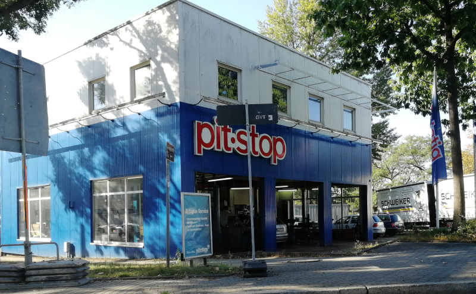

# Pitstop - Garage Management System
This repo contains a sample application based on a Garage Management System for Pitstop - a fictitious garage / car repair shop. The primary goal of this sample is to demonstrate several software-architecture concepts like:  
* Microservices  
* CQRS  
* Event driven Architecture  
* Event sourcing  
* Domain Driven Design (DDD)  
* Eventual Consistency  

and how to use container-technologies like:

* Docker
* Kubernetes
* Istio (service-mesh)
* Linkerd (service-mesh)

See [the Wiki for this repository](https://github.com/EdwinVW/pitstop/wiki "Pitstop Wiki") for more information about the solution and instructions on how to build, run and test the application using Docker-compose and Kubernetes.

> This is an actual garage somewhere in Dresden Germany. Thanks to Thomas Moerkerken for the picture!
