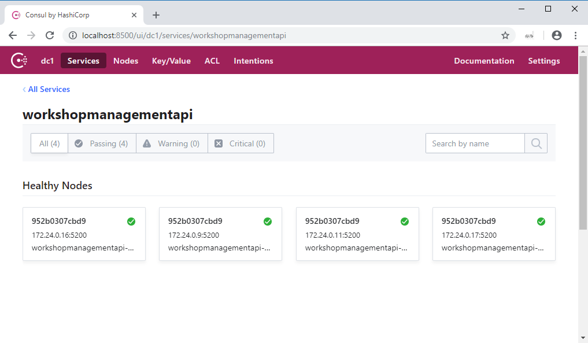
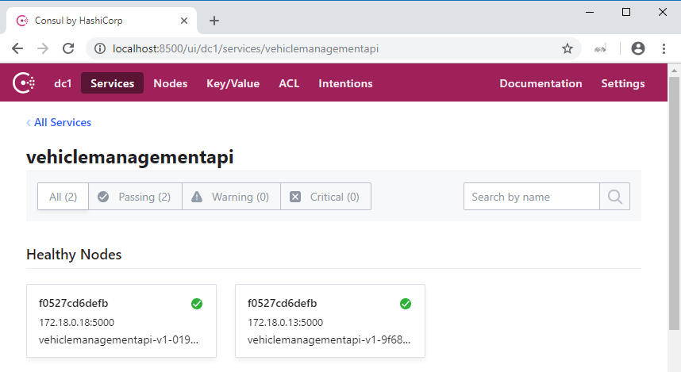
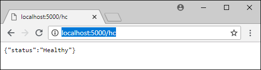

# Pitstop - Garage Management System
This repo contains a sample application based on a Garage Management System for PitStop - a fictitious garage / car repair shop.


> This is an actual garage somewhere in Dresden Germany. Thanks to Thomas Moerkerken for the picture!

The application targets the employees of PitStop and supports their daily tasks. It should offer the following functionality:

- Manage customers
- Manage vehicles
- Manage the workshop (planning)
- Manage inventory (products and parts)
- Sales (direct sales of products and parts)
- Sending invoices to customers
- Sending notifications to customers 

>The primary goal of this sample is to demonstrate several Web-Scale Architecture concepts like: Microservices, CQRS, Event Sourcing, Domain Driven Design (DDD), Eventual Consistency and API Gateway.

### Context-map
I've created a context-map that describes the bounded contexts (DDD) within the system and the relationships between them:


If you look at the context-map, you can figure out that Workshop Management is the primary bounded-context. This is where PitStop Garage makes its money. That's why I chose to use a DDD approach (with Aggregates) and event-sourcing for this one. Customer Management and Vehicle Management are supporting bounded-contexts for which I've used a standard CRUD approach.

I've decided to leave support for Inventory Management (Products) and Sales out of the sample because this doesn't add enough value. As stated, the primary goal of this sample is to demonstrate different architectural concepts and not to be a full fledged application.

With every relationship I've specified which side of the relationship is Upstream (U) and which side is Downstream (D). Using these indications you can figure out which bounded-context in the system is the system of record (source of truth) for a certain piece of information. We call that side the upstream side. This side dictates the schema of the data and always holds the latest version of the data (the "truth"). The downstream side has to follow and use some approach to make sure it can use (and optionally cache) the data from the upstream system. 

So for instance: vehicles are registered and maintained in the Vehicle Management bounded-context. But within the Workshop Management bounded-context, we need to have some vehicle information to be able to operate - even when the Vehicle service is offline (autonomy is very important in a Microservices architecture). So Vehicle information is cached within the Workshop Management bounded-context. This cache is kept up-to-date by handling events that are being published by the Vehicle Management bounded-context. 

#### Domain objects
The application uses the following domain-objects:

| Name             | Description                                                                                                   |
|:-----------------|:--------------------------------------------------------------------------------------------------------------|
| Vehicle          | Represents a vehicle.                                                                                         |
| Customer         | Represents a customer that owns one or more vehicles.                                                          |
| WorkshopPlanning | Represents the planning for the workshop during a single day. A planning contains 0 or more maintenance jobs. |
| MaintenanceJob   | Represents a job to executed on a single vehicle.                                                            |
| Product          | Represents a product (or part) that is used when executing a maintenance job or sold directly to a customer.  |
| Sale             | Represents a direct sale of a product to a customer (not related to a maintenance job).                        |
| Invoice          | Represents an invoice sent to a customer for 1 or more finished maintenance-jobs.                             |

### Solution Architecture
I've created a solution architecture diagram which shows all the moving parts in the application. You will probably recognize how the different bounded-contexts in the context-map are represented by the services in this architecture:


#### PitStop Web App
The web application is the front-end for the system. Users can manage customers, vehicles and the planning for the workshop from this front-end. The front-end will only communicate with the different APIs in the system (throug the API Gateway) hand has no knowledge of the message-broker or any other services.

#### API Gateway
The API Gateway abstracts all the APIs in the solution. The PitStop web application calls all APIs through the API Gateway. The API Gateway also offers location-transparency and load-balancing of APIs. It uses the *DiscoveryService* to determine the available instances of the services it load-balances.

#### Discovery Service
The Discovery service is a service that administers the available running instances of the API services. When an API service is started, it registers itself with the Discovery Service. When the service stops, it de-registers itself. The API gateway load-balances the workload over the available instances of the services that are registered with the Discovery Service.

#### Customer Management Service
This service offers an API that is used to manage Customers in the system. For now, only CREATE and READ functionality (list and single by unique Id) is implemented. 

This service handles the following commands:

- RegisterCustomer

This service publishes the following events:

- CustomerRegistered

#### Vehicle Management Service
This service offers an API that is used to manage Vehicles in the system. For now, only CREATE and READ functionality (list and single by unique Id) is implemented. 

This service handles the following commands:

- RegisterVehicle

This service publishes the following events:

- VehicleRegistered

#### Workshop Management Service
This service contains 2 parts: an API for managing the workshop planning and an event-handler that handles events and builds a read-model that is used by the API. 

##### API
This is an API that is used to manage Maintenance Jobs in the system. Because we want to be able to keep Workshop Management up and running even when other services are down, the API also offers functionality to retrieve vehicle and customer information from the read-model. This read-model is filled by the event-handler (described below). To ensure the availability of this API, multiple instances of this API can be started. These instances will be load-balanced by the API Gateway.

This service handles the following commands:

- PlanMaintenanceJob
- FinishMaintenanceJob

This service publishes the following events:

- WorkshopPlanningCreated
- MaintenanceJobPlanned
- MaintenanceJobFinished

Within this bounded-context I've used a DDD approach. The Workshop Planning aggregate handles all commands and yields events that will then be published using the message-broker.

Because this aggregate uses event-sourcing for persisting its state, every command that comes in is first transformed into an event that is handled by the aggregate. This will actually change the internal state of the aggregate. The state is persisted by storing the list of all events that occurred for 1 aggregate instance. When another command comes in for an aggregate instance (identified by its unique Id), all events are replayed and handled by the aggregate to return it to its former state. The aggregate offers a specific constructor that takes a list of events and replays them internally.

##### Event-handler
The event-handler ingests events containing information about Customers and Vehicles coming from the message-broker. It only handles events from the message-broker and offers no API. As stated above, it builds a read-model that is used by the front-end when scheduling maintenance jobs. This ensures that we can always schedule new maintenance jobs and manage existing jobs even though the Customer Service or Vehicle Service is offline.

This service handles the following events:

- CustomerRegistered
- VehicleRegistered
- MaintenanceJobPlanned
- MaintenanceJobFinished

#### Notification Service
The notification service sends a notification to every customer that has a maintenance job planned on the current day. It only handles events from the message-broker and offers no API. 

This service handles the following events:

- CustomerRegistered
- DayHasPassed
- MaintenanceJobPlanned
- MaintenanceJobFinished

#### Invoice Service
The invoice service creates an invoice for all maintenance jobs that have been finished (and are not yet invoiced). It only handles events from the message-broker and offers no API. The invoice is created as an HTML email message which is emailed to PrestoPrint, a fictitious printing company.

This service handles the following events:

- CustomerRegistered
- DayHasPassed
- MaintenanceJobPlanned
- MaintenanceJobFinished

#### Time Service
The Time service is a service that informs other services when a certain time-period has passed. For now only the *DayHasPassed* event is supported.

I chose this approach to make testing of time-related functionality simple without the need for messing with the system-clock on test-machines. So instead of acting upon time-outs based on the system-time, services act upon events.

This service publishes the following events:

- DayHasPassed

#### Auditlog Service
The AuditLog service picks up all events from the message-broker and stores them for later reference. It only handles events from the message-broker and offers no API. 

## Technology
This chapter describes the technology and libraries used to build this application. I'm not going to describe in detail how the different components work. For that I refer you to the documentation of each component on the Internet.

**.NET Core & ASP.NET Core**  
The application is built completely using .NET Core and ASP.NET Core. See [https://dot.net](https://dot.net ".NET web-site") for more info.

**Docker**  
Every service within the system and all infrastructural components (database, message-broker, mail-server) are run in a Docker container. In this solution, only Linux based containers are used. Docker Compose is used to compose the application and connect all the components. See [https://www.docker.com/](https://www.docker.com/ "Docker web-site") for more info.

**RabbitMQ**  
RabbitMQ is used as message-broker. I use a default RabbitMQ Docker image (including management) from Docker Hub (`rabbitmq:3-management`). See [https://www.rabbitmq.com/](https://www.rabbitmq.com/ "RabbitMQ web-site") for more info.

**SQL Server on Linux**  
The database server used to host all databases is MS SQL Server running on Linux. I use a default SQL Server for Linux Docker image from Docker Hub (`microsoft/mssql-server-linux`). In this sample application, I chose to use a single SQL Server instance for hosting all databases. In a production environment you could choose for a setup with multiple instances to enable fail-over scenarios in case of an emergency.

**MailDev**  
To simulate sending emails, I use MailDev. This test-server acts as both an SMTP Server as a POP3 server and offers a website to see the mails that were sent. No emails are actually sent when using this test-server. I use the default MailDev Docker image from Docker Hub (`djfarrelly/maildev`). See [https://github.com/djfarrelly/MailDev](https://github.com/djfarrelly/MailDev "MailDev Github repo") for more info.

**Ocelot**  
Ocelot is an open-source API Gateway built on .NET Core. It is used to implement the API Gateway in the PitStop solution. See [https://github.com/ThreeMammals/Ocelot](https://github.com/ThreeMammals/Ocelot) for more info. Ocelot uses Consul (described below) for dynamic service-discovery.

**Consul**  
Consul is an open-source service-mesh tool that can be used for service-discovery. Services can register themselves with Consul when they start and de-register themselves when they stop. 
See [https://www.consul.io/](https://www.consul.io/) for more info.

**Serilog**  
Serilog an open-source logging framework for .NET (Core). It supports semantic/structured logging. All components within the solution use Serilog for logging information and errors. Log information is sent to the Console and to a Seq server (described below). See [https://serilog.net/](https://serilog.net/) for more info.

**Seq**  
Seq is a central log server that can aggregate logging from several different logging-frameworks (including Serilog). It supports structured logging and offers rich searching and filtering capabilities. All logging within the PitStop solution is sent to Seq. See [https://getseq.net/](https://getseq.net/) for more info.

**AutoMapper**  
AutoMapper is used (only where it adds value) to map between POCOs. This is primarily handy when mapping commands to events, events to events or events to models. See [http://automapper.org/](http://automapper.org/ "Automapper web-site") for more info.

**Polly**  
Polly is used to make sure the services are resilient to outages of other services. It offers automatic retry or circuit-breaker logic that is used at every interaction with resources that could be down (database, message-broker, other services). It is used in the web application for retrying calls to the Web APIs and falling back to an off-line page when a call fails after a certain amount of retries. See [https://github.com/App-vNext/Polly](https://github.com/App-vNext/Polly "Polly Github repo") for more info.

**Refit**  
Refit is used to simplify calling REST APis. See [https://github.com/paulcbetts/refit](https://github.com/paulcbetts/refit "Refit Github repo") for more info. 

**SwashBuckle**  
Swashbuckle is used for auto-generating Swagger documentation and a test-ui for the ASP.NET Web APIs. See [https://github.com/domaindrivendev/Swashbuckle](https://github.com/domaindrivendev/Swashbuckle "Swashbuckle Github repo") for more info.

**Dapper**  
Dapper is used in several services as lightweight ORM layer. See [https://github.com/StackExchange/Dapper](https://github.com/StackExchange/Dapper "Dapper Github repo") for more info.

**XUnit**  
XUnit is a unit-testing framework. It is used in the WorkshopManagementAPI.UnitTests project. See [https://xunit.github.io](https://xunit.github.io) for more info.

**Moq**  
Moq is a mocking framework. It is used in the WorkshopManagementAPI.UnitTests project. See [https://github.com/Moq/moq4/wiki/Quickstart](https://github.com/Moq/moq4/wiki/Quickstart) for more info.

**Selenium**  
Selenium is a UI testing framework for driving a browser or application in an automated test. It is used in the UITest project. See [https://www.seleniumhq.org/](https://www.seleniumhq.org/) for more info.  

## Solution Folder structure
The Visual Studio solution contains several files and folders. Most folders correspond to a component in the solution architecture. Look there for an in-depth description of the functionality of a component.

- **Solution items**
	- **ClearDatabases.sql** : a sql script to empty all the SQL databases of the solution.
	- **docker-compose.yml** : the docker-compose file for the application.
	- **RebuildAllDockerImages.ps1** / **RebuildAllDockerImages.sh** : do a docker build of all the projects in the solution.
	- **RemoveUnusedImages.ps1** / **RemoveUnusedImages.sh** : removes "dangling" docker images (without a name).
    - **StartSolution.ps1** / **StartSolution.sh** : run the project in the background, and start tailing the logs for all the containers. You can crtl-c from viewing the logs, and the the containers keep running.
    - **StartSolutionHA.ps1** / **StartSolutionHA.sh** : run the project in the background with multiple instances of the API services load-balanced by the API Gateway.
	- **StopAndRemoveAllContainers.ps1** / **StopAndRemoveAllContainers.sh** : stops and removes all containers.
	- **nuget.config** : config file for NuGet containing the NuGet feeds used by the solution.
- **APIGateway** : the API Gateway.
- **AuditlogService** : the AuditLog service.
- **CustomerManagementAPI** : the Web API for managing customer data ("CRM").
- **Infrastructure.Messaging** - an infrastructural library that offers messaging capabilities using 	RabbitMQ. 
- **Infrastructure.ServiceDiscovery** - an infrastructural library that offers service-discovery 	capabilities using Consul. 
- **InvoiceService** - the service that sends invoices for executed maintenance.
- **NotificationService** - the service that sends customers a notification when they have an appointment.
- **TimeService** - the service that lets "the world" know a certain period of time has passed. The current implementation only supports days. 
- **UITest** - UI tests (using Selenium) for integration-/regression-testing.
- **VehicleManagementAPI** - the Web API for managing vehicle data.
- **WebApp** - the front-end web-application used by the end-users of the system (employees of PitStop garage).
- **WorkshopManagement.UnitTests** - the unit-tests for the WorkshopManagement domain.
- **WorkshopManagementAPI** - the Web API for managing workshop data.
- **WorkshopManagementEventHandler** - the event-handler picking up events and creating the read-model for the WorkshopManagement bounded-context.

## Building the Docker images
In order to run the application you need to take several steps. This description assumes you're developing on a Windows machine using Visual Studio 2017 or Visual Studio Code and already downloaded or forked and pulled the latest version of the source-code from the repo.

> In the `docker-compose.yml` file in the root of the solution folder there are some credentials specified for components that need them. These are also used by the different services that use these components (specified in config files): SQL Server login: sa / 8jkGh47hnDw89Haq8LN2, Rabbit MQ login: rabbitmquser / DEBmbwkSrzy9D1T9cJfa

- Satisfy prerequisites
    - Make sure you have Docker installed and running smoothly on your machine. This sample only uses Linux based containers. Also make sure everything is configured correctly in order to pull Docker images from the public Docker hub.
    - Increase the amount of memory dedicated to Docker to at least 4 GB. You can do this on the *Advanced* tab of the Docker settings dialog:

	 

- Configure monitoring (optional).   
   The WebAPIs and Web-Application use Application Insights (AI) for monitoring. When using AI, you can monitor all kinds of characteristics of your application. AI also can automatically build a map of your application:

   

   The name of the nodes is determined by a field called *cloud role name* in the telemetry. This property can be set in several ways. In this case I've chosen to specify the name by setting the environment-variable named *WEBSITE_SITE_NAME*. I set the variable in the Docker file of the WebAPI's and Web-Application using the *ENV* statement.

   If you want to use AI monitoring take the following steps:
   - Create an AI resource in Azure. 
   - Copy the *instrumentation key* from your AI resource. 
   - Create a system-wide environment-variable with the name *PitStopAIKey* and the key as value. The key is read at run-time from the environment-variable.  
   

- Open the PitStop solution in Visual Studio or in Visual Studio Code.  

- When using Visual Studio, add a NuGet source
   To prevent project-references between projects in the solution, I've used a public MyGet feed for shared components. The URI for this feed is: `https://www.myget.org/F/pitstop/api/v3/index.json`. This feed contains the *Infrastructure.Messaging* and *Infrastructure.ServiceDiscovery* packages. Open Visual Studio and configure the NuGet sources and add the MyGet feed: 

   .

   > The MyGet feed is read-only. So if you want to make changes to the InfraStructure package, create a pull request with the necessary changes (don't forget to update the version of the package). I will then push the latest version of the package to the MyGet feed.

- Rebuild solution
   To make sure everything is setup correctly, do a Rebuild All of the solution. This will also restore all the NuGet packages used throughout the solution. If no errors occur, you're good to go.

- Build docker images
   Open up a Powershell window and go to the `Pitstop/src` folder. Then execute the `RebuildAllDockerImages` script. This will rebuild all the Docker images for all the projects. Watch the output for any errors. After the images are built, you could check whether they are all there using the `docker images` command. This should yield something like this: 

   

   As part of the `RebuildAllDockerImages` script, two Docker volumes are created. One for the SQL Server data and one for the RabbitMQ data. This ensures that data for these infrastructural components survives restarts of the Containers. If you don't use the `RebuildAllDockerImages` script, you can create the volumes by hand:

   - `docker volume create sqlserverdata`
   - `docker volume create rabbitmqdata` 

## Starting the application
This is it, you're now ready to spin up the system! Open up a Powershell window and go to the `Pitstop/src` folder. Then issue the following command: `docker-compose up`. This will start the solution with a single instance of the API services.

If you want to start the solution with multiple instances of the API services running, use the following command: `docker-compose up -d --scale customermanagementapi=2 --scale vehiclemanagementapi=2 --scale workshopmanagementapi=3`. This uses the *scale* argument to specify the number of instances of each services that must be started. The API gateway will automatically load-balance the workload over the available instances. 

You can also use the *StartSolution.ps1* / *StartSolution.sh* (single instance) or *StartSolutionHA.ps1* / *StartSolutionHA.sh* (multiple instances) scripts to start the solution.

When the solution starts, you will see all the logging being emitted from the different components. You will probably see a couple of *Unable to connect to RabbitMQ/SQL Server, retrying in 5 sec.* messages in there. This is expected and not a problem. This is Polly doing its work to make sure that failures that occur when calling a component that is still starting up are handled gracefully. 

The first time the services are started, the necessary databases are automatically created. You could check this by connecting to the SQL Server using SSMS (server *localhost*, port 1434; separate the server and port with a comma in SSMS: `localhost,1434`) and looking at the different databases:


Upon the registration of the first Maintenance Job, the event-store database *WorkshopManagementEventStore* will be created automatically.

> In places where the services access external resources (e.g. RabbitMQ or SQL Server), I have added retry logic to cope with stuff not being up & running when accessing it. But sometimes when you run the application for the first time, starting and initializing SQL Server takes a lot longer. So you could run into the situation that starting and initializing the SQL Server takes longer than the configured timeout and the services are unable to access the database. You will see errors in the logging and the application will not run correctly. In that case, just stop the containers (`Ctrl-C`) and try again using `docker-compose up`.   

## Testing the application
To test the application you need to open the following web-pages:

- The RabbitMQ management dashboard: [http://localhost:15672](http://localhost:15672).   
   Username: rabbitmquser  
   Password: DEBmbwkSrzy9D1T9cJfa

- The MailDev inbox: [http://localhost:4000](http://localhost:4000).

- The PitStop web-application: [http://localhost:7000](http://localhost:7000).

- The Seq logging console: [http://localhost:5341](http://localhost:5341).

Now you can follow the following scenario (make sure you fill all the fields in the entry-forms):

- Register a new customer on the *Customer Management* screen.
- Register a new Vehicle for this customer on the *Vehicle Management* screen.
- Register a couple of Maintenance Jobs for the vehicle on the *Workshop Management* screen.

Now you've used the basic functionality of the application. We'll test the functionality of the *Notification service* next. 

### Testing notifications
To test the *Notification Service*, make sure you have scheduled a Maintenance Job for today. The *Notification service* reacts to the *DayHasPassed* event that is normally published by the *Time service*. But in stead of waiting until midnight, we'll publish such an event using the RabbitMQ Management Dashboard. Open the browser window (or tab) that shows the RabbitMQ Management Dashboard. Go to the *Exchanges* tab and click the *PitStop* exchange. Now expand the *Publish message* part of the screen. To send the correct event, we need to add a header to the message. You do this by adding a header named *MessageType* and value *DayHasPassed*. The body (payload) of the message should contain an empty object (defined in JSON):


Now you can push the *Publish message* button to send the message. If all goes according to plan, the *Notification Service* will pick up this event, check whether there is a maintenance job scheduled for today (for which no notification has been sent yet) and send a notification email to the customer. This email should be visible in the MailDev in-box:


### Testing invoicing
To test the *Invoice Service*, make sure you have scheduled a Maintenance Job for today. Now first complete this Maintenance Job on the *Workshop Management* screen.

The *Invoice service* reacts to the *DayHasPassed* event that is normally published by the *Time service*. But in order to speed this up, we'll publish such an event using the RabbitMQ Management Dashboard. See the description of how to do this under *Testing Notifications* above.

If all goes according to plan, the *Invoice Service* will pick up this event, check whether there are any maintenance jobs completed today (for which no invoice has been sent yet) and send an invoice HTML email to *Presto Print* (a fictitious printing company that will print and snail-mail the invoice to the customer). This email should be visible in the MailDev in-box:


### Testing APIs
If you want to test the individual APIs in the system, you can use the test UIs that are auto-generated by Swashbuckle. 

In order to test de API's directly, you need to start the solution using the *docker-compose.local.yml* override file. You do this by starting the solution using the following command: `docker-compose -f docker-compose.yml -f docker-compose.local.yml up`. This will make sure that the ports used by the API services are exposed to the host so you can access them directly from the browser. 

The following URLs can be used:

| API                | URL                                                            |
|:-------------------|:---------------------------------------------------------------|
| CustomerManagement | [http://localhost:5100/swagger](http://localhost:5100/swagger) |
| VehicleManagement  | [http://localhost:5000/swagger](http://localhost:5000/swagger) |
| WorkshopManagement | [http://localhost:5200/swagger](http://localhost:5200/swagger) |

### The API Gateway
All APIs are aggregated by the API Gateway. 

The gateway runs on port 10000 and it serves the following end-points:

| Resource           | Gateway URL           | API URL                                         |
|:-------------------|:----------------------|:------------------------------------------------|
| Customers          | /api/customers        | customermanagementapi:5100/api/customers        |
| Vehicles           | /api/vehicles         | vehiclemanagementapi:5000/api/vehicles          |
| Workshop planning  | /api/workshopplanning | workshopmanagementapi:5200/api/workshopplanning |
| Workshop Refdata   | /api/refdata          | workshopmanagmeentapi:5200/api/refdata          |

The configuration of the API Gateway is situated in the *APIGateway* project in the *OcelotConfig* folder. There is a separate folder for the *Development* and *Production* environment. For every API a separate config file exists. See the [Ocelot documentation](https://ocelot.readthedocs.io/en/latest/) for more info about the configuration-format.

> When you change the configuration, make sure to rebuild the API Gateway Docker container! The config file is stored inside the container. If you want to be able to change the configuration "on the fly", define and mount a Docker volume and put the config file there.

**Development environment**
The configuration for an API (in this case the *CustomerManagement API*) looks something like this for the development environment:

```
{
  "ReRoutes": [
    {
      "ServiceName": "CustomerManagementAPI",
      "UpstreamPathTemplate": "/api/customers/",
      "DownstreamPathTemplate": "/api/customers",
      "DownstreamScheme": "http",
      "DownstreamHostAndPorts": [
        {
          "Host": "customermanagementapi",
          "Port": 5100
        }
      ]
    },
    {
      "ServiceName": "CustomerManagementAPI",
      "UpstreamPathTemplate": "/api/customers/{trailingSegments}",
      "DownstreamPathTemplate": "/api/customers/{trailingSegments}",
      "DownstreamScheme": "http",
      "DownstreamHostAndPorts": [
        {
          "Host": "customermanagementapi",
          "Port": 5100
        }
      ]
    }
  ]
}
```

For this environment, the downstream hosts and ports are statically configured in the Ocelot configuration-file. The first routing-rule matches `http://<host>/api/customers` for getting all the customers. The second rule matches `http://<host>/api/customers/<whatever>`. Because everything that is specified as `<whatever>` after `/api/customers/` is forwarded to the downstream API, I only need to specify routing-rules for each individual API controller. ASP.NET Core MVC routing in the downstream API that is called will take care of the rest. 

This approach saves me from having to write lots of configuration. Especially for the WorkshopManagement API which serves up several resources:

- /api/workshopplanning/{date}
- /api/workshopplanning/{date}/jobs
- /api/workshopplanning/{date}/jobs/{jobId}
- /api/refdata/customers
- /api/refdata/vehicles

**Production Environment**
When running in Docker containers - the *Production* environment - multiple instances of the the API services can be started. Work will be load-balanced over these instances. To start multiple instances, specify this on the command-line when using docker-compose:

```
docker-compose up --scale customermanagementapi=2 --scale vehiclemanagementapi=3 --scale workshopmanagementapi=3
```

This will start 2 instances of the CustomerManagementAPI, 2 instances of the VehicleManagementAPI and 3 instances of this service. Each service will register itself with the *DiscoveryService* (the Consul service) upon start-up. 

In the *Production* configuration of the API Gateway, you can see a *Round Robin* style load-balancer is configured in the Ocelot config-files:

```
{
  "ReRoutes": [
    {
      "Key": "WorkshopPlanningAPI",
      "UpstreamPathTemplate": "/api/workshopplanning/{trailingSegments}",
      "DownstreamPathTemplate": "/api/workshopplanning/{trailingSegments}",
      "DownstreamScheme": "http",
      "ServiceName": "workshopmanagementapi",
      "LoadBalancerOptions": {
        "Type": "RoundRobin"
      }
    },
    {
      "Key": "WorkshopRefDataAPI",
      "UpstreamPathTemplate": "/api/refdata/{trailingSegments}",
      "DownstreamPathTemplate": "/api/refdata/{trailingSegments}",
      "DownstreamScheme": "http",
      "ServiceName": "workshopmanagementapi",
      "LoadBalancerOptions": {
        "Type": "RoundRobin"
      }
    }
  ]
}
```

As you can see, no *DownStreamHostsAndPorts* section exists in this configuration. This is because the API Gateway is configured to use *Consul* for dynamic service-discovery. This is specified in the `ocelot.global.json` configuration file in the *Production* folder:

```
{
  "GlobalConfiguration": {
    "BaseUrl": "http://apigateway:10000",
    "ServiceDiscoveryProvider": {
      "Host": "discoveryservice",
      "Port": 8500,
      "Type": "Consul"
    }  
  }
}
```

If you want to see whether or not multiple instances of the service are registered with the discovery service, point your browser to [http://localhost:8500](http://localhost:8500) where the Consul UI is running. You will see multiple instances of the API services:



If you click a particular service, you can see the instances that are registered for this service. Each instance is a separate container. For instance, the VehicleManagementAPI service:



> I've added this way of load-balancing to the sample application to experiment with using Consul for service-discovery with Ocelot. Because the host-names of the API services are automatically generated when started, I needed this service-discovery mechanism. 
> 
> But this is actually a bit of overkill. Because docker networking can also handle load-balancing over multiple instances of a service automatically. When you create multiple instances of a service, you can reach each an instance by its service-name as specified in the docker-compose file. Each connection will be load-balanced over the available instances. So you don't actually need to know the actual host-names of the running instances. I could have configured Ocelot to just use the service-name as host (e.g. *customermanagementapi*) and docker networking would load balance over the running instances (e.g. *src_customermanagementapi_1*, *src_customermanagementapi_2*, ...).  

## Logging
To make sure you can see what's going on with the application, a lot of informational, warning- and error-logging is emitted. This logging can be seen in on the console (output of docker-compose). But a better way to look at this logging is using the Seq server that is part of the solution. If you start the application and it for some time, point your browser to [http://localhost:5341](http://localhost:5341) and you will see the Seq console with all the logging information:


See [https://docs.getseq.net/docs/query-syntax](https://docs.getseq.net/docs/query-syntax) for more information on how to use the Seq console to search and filter the logging information.

## Health-monitoring
Every API service and the web-application are equipped with a health-monitoring end-point. You can check the health of the service by doing an HTTP request to the health-check URL (`/hc`):

 

The health-checks are implemented using the Microsoft health-monitoring libraries (*Microsoft.AspNetCore.HealthChecks*). See [the docs](https://docs.microsoft.com/en-us/dotnet/standard/microservices-architecture/implement-resilient-applications/monitor-app-health) for more info. The services that use a SQL Server will also do a check on whether they can connect to the server configured in the connection-string.

In the `Dockerfile` of the services, a `HEALTHCHECK` statement is added. This check will periodically (every 30 seconds) check the health of the service by calling the health-check URL of the service:

```
HEALTHCHECK --interval=30s --timeout=3s --retries=1 CMD curl --silent --fail http://localhost:5100/hc || exit 1
```

## Automated tests
The Pitstop solution contains 2 types of tests: unit-tests and UI tests. 

Unit-tests exist for the WorkshopManagementAPI (core domain) and are situated in the *WorkshopManagement.UnitTests* project. There are tests for the domain classes and for the command-handlers. You can run the tests by executing the following steps:

- Open a command-prompt.
- Change the current-folder to the *src/WorkshopManagement.UnitTests* folder within the repo.
- Execute the following command: `dotnet test`.

The UI tests are situated in the *UITest* project. This project contains some tests that test the following functionality: all the menu-buttons in the UI, adding a customer, adding a vehicle, adding a maintenance-job and finishing a maintenance-job. It does this by automating the browser using the Selenium Chrome web-driver (so it only works with Chrome for now). These tests are mainly used for integration-/regression-testing. You can run the tests by executing the following steps:

- Start the application as described above.
- Open a command-prompt.
- Change the current-folder to the *src/UITest* folder within the repo.
- Execute the following command: `dotnet test`.

Several browser-windows will be opened and automated by the Selenium web-driver.

## Contributing
This sample is a personal R&D project for me to learn. I've tried to document it as thoroughly as possible for people wanting to learn from it. If you have any improvements you want to contribute (to the code or the documentation) or find any bugs that need solving, just create an issue or a pull-request!

## Disclaimer
The code in this repo is NOT production grade and lacks any automated testing. It is intentionally kept as simple as possible (KISS). Its primary purpose is demonstrating several architectural concepts and not being a full fledged application that can be put into production as is. 

The author can in no way be held liable for damage caused directly or indirectly by using this code.
