# Pitstop - Garage Management System
This repo contains a sample application based on a Garage Management System for PitStop - a fictitious garage. The application targets the employees of PitStop and supports their daily tasks. It should offer the following functionality:

- Manage customers
- Manage vehicles
- Manage the workshop (planning)
- Manage inventory (products and parts)
- Sales (direct sales of products and parts)
- Sending invoices to customers
- Sending notifications to customers 

>The primary goal of this sample is to demonstrate several Web-Scale Architecture concepts like: Microservices, CQRS, Event Sourcing, Domain Driven Design (DDD) and Eventual Consistency.

### Context-map
I've created a context-map that describes the bounded contexts (DDD) within the system and the relationships between them:

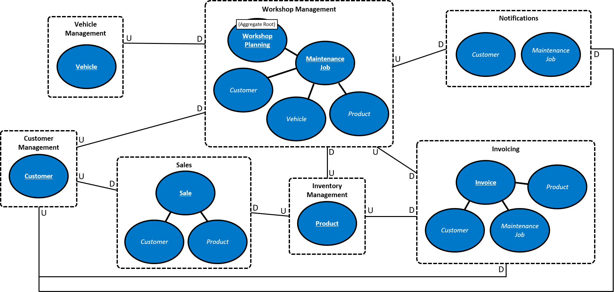

If you look at the context-map, you can figure out that Workshop Management is the primary bounded-context. This is where PitStop Garage makes its money. That's why I chose to use a DDD approach (with Aggregates) and event-sourcing for this one. Customer Management and Vehicle Management are supporting bounded-contexts for which I've used a standard CRUD approach.

I've decided to leave support for Inventory Management (Products) and Sales out of the sample because this doesn't add enough value. As stated, the primary goal of this sample is to demonstrate different architectural concepts and not to be a full fledged application.

With every relationship I've specified which side of the relationship is Upstream (U) and which side is Downstream (D). Using these indications you can figure out which bounded-context in the system is the system of record (source of truth) for a certain piece of information. We call that side the upstream side. This side dictates the schema of the data and always holds the latest version of the data (the "truth"). The downstream side has to follow and use some approach to make sure it can use (and optionally cache) the data from the upstream system. 

So for instance: vehicles are registered and maintained in the Vehicle Management bounded-context. But within the Workshop Management bounded-context, we need to have some vehicle information to be able to operate - even when the Vehicle service is offline (autonomy is very important in a Microservices architecture). So Vehicle information is cached within the Workshop Management bounded-context. This cache is kept up-to-date by handling events that are being published by the Vehicle Management bounded-context. 

#### Domain objects
The application uses the following domain-objects:

| Name             | Description                                                                                                   |
|------------------|---------------------------------------------------------------------------------------------------------------|
| Vehicle          | Represents a vehicle.                                                                                         |
| Customer         | Represents a customer that owns one or more vehicles.                                                          |
| WorkshopPlanning | Represents the planning for the workshop during a single day. A planning contains 0 or more maintenance jobs. |
| MaintenanceJob   | Represents a job to executed on a single vehicle.                                                            |
| Product          | Represents a product (or part) that is used when executing a maintenance job or sold directly to a customer.  |
| Sale             | Represents a direct sale of a product to a customer (not related to a maintenance job).                        |
| Invoice          | Represents an invoice sent to a customer for 1 or more finished maintenance-jobs.                             |

### Solution Architecture
I've created a solution architecture diagram which shows all the moving parts in the application. You will probably recognize how the different bounded-contexts in the context-map are represented by the services in this architecture:

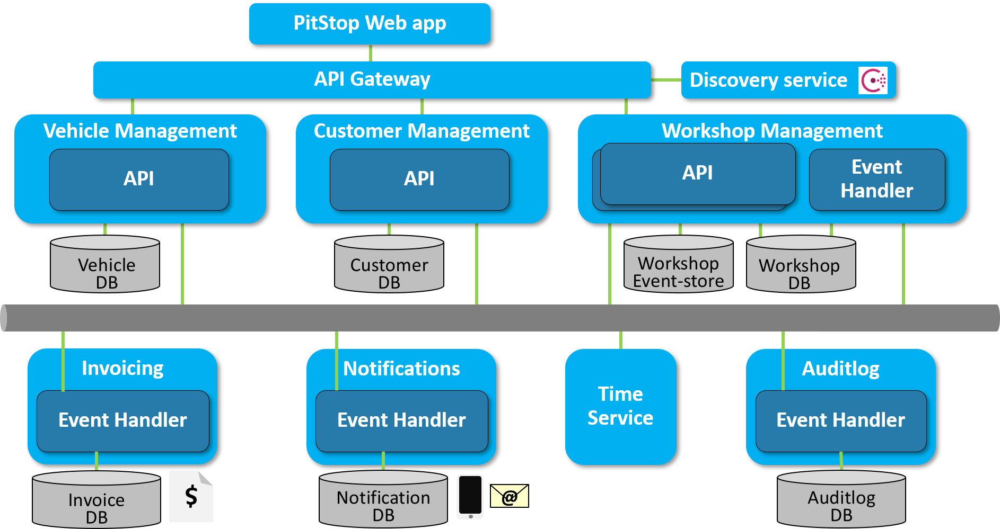

#### PitStop Web App
The web application is the front-end for the system. Users can manage customers, vehicles and the planning for the workshop from this front-end. The front-end will only communicate with the different APIs in the system and has no knowledge of the message-broker or any other services.

#### Customer Management Service
This service offers an API that is used to manage Customers in the system. For now, only CREATE and READ functionality (list and single by unique Id) is implemented. 

This service handles the following commands:

- RegisterCustomer

This service publishes the following events:

- CustomerRegistered

#### Vehicle Management Service
This service offers an API that is used to manage Vehicles in the system. For now, only CREATE and READ functionality (list and single by unique Id) is implemented. 

This service handles the following commands:

- RegisterVehicle

This service publishes the following events:

- VehicleRegistered

#### Workshop Management Service
This service contains 2 parts: an API for managing the workshop planning and an event-handler that handles events and builds a read-model that is used by the API. 

##### API
This is an API that is used to manage Maintenance Jobs in the system.Because we want to be able to keep Workshop Management up and running even when other services are down, the API also offers functionality to retrieve vehicle and customer information from the read-model. This read-model is filled by the event-handler (described below).

This service handles the following commands:

- PlanMaintenanceJob
- FinishMaintenanceJob

This service publishes the following events:

- WorkshopPlanningCreated
- MaintenanceJobPlanned
- MaintenanceJobFinished

Within this bounded-context I've used a DDD approach. The Workshop Planning aggregate handles all commands and yields events that will then be published using the message-broker.

Because this aggregate uses event-sourcing for persisting its state, every command that comes in is first transformed into an event that is handled by the aggregate. This will actually change the internal state of the aggregate. The state is persisted by storing the list of all events that occurred for 1 aggregate instance. When another command comes in for an aggregate instance (identified by its unique Id), all events are replayed and handled by the aggregate to return it to its former state. The aggregate offers a specific constructor that takes a list of events and replays them internally.

##### Event-handler
The event-handler ingests events containing information about Customers and Vehicles coming from the message-broker. It only handles events from the message-broker and offers no API. As stated above, it builds a read-model that is used by the front-end when scheduling maintenance jobs. This ensures that we can always schedule new maintenance jobs and manage existing jobs even though the Customer Service or Vehicle Service is offline.

This service handles the following events:

- CustomerRegistered
- VehicleRegistered
- MaintenanceJobPlanned
- MaintenanceJobFinished

#### Notification Service
The notification service sends a notification to every customer that has a maintenance job planned on the current day. It only handles events from the message-broker and offers no API. 

This service handles the following events:

- CustomerRegistered
- DayHasPassed
- MaintenanceJobPlanned
- MaintenanceJobFinished

#### Invoice Service
The invoice service creates an invoice for all maintenance jobs that have been finished (and are not yet invoiced). It only handles events from the message-broker and offers no API. The invoice is created as an HTML email message which is emailed to PrestoPrint, a fictitious printing company.

This service handles the following events:

- CustomerRegistered
- DayHasPassed
- MaintenanceJobPlanned
- MaintenanceJobFinished

#### Time Service
The Time service is a service that informs other services when a certain time-period has passed. For now only the *DayHasPassed* event is supported.

I chose this approach to make testing of time-related functionality simple without the need for messing with the system-clock on test-machines. So instead of acting upon time-outs based on the system-time, services act upon events.

This service publishes the following events:

- DayHasPassed

#### Auditlog Service
The AuditLog service picks up all events from the message-broker and stores them for later reference. It only handles events from the message-broker and offers no API. 

## Technology
This chapter describes the technology and libraries used to build this application. I'm not going to describe in detail how the different components work. For that I refer you to the documentation of each component on the Internet.

**.NET Core & ASP.NET Core**
The application is build completely using .NET Core and ASP.NET Core. See [https://dot.net](https://dot.net ".NET web-site") for more info.

**Docker**
Every service within the system and all infrastructural components (database, message-broker, mail-server) are run in a Docker container. In this solution, only Linux based containers are used. Docker Compose is used to compose the application and connect all the components. See [https://www.docker.com/](https://www.docker.com/ "Docker web-site") for more info.

**RabbitMQ**
RabbitMQ is used as message-broker. I use a default RabbitMQ Docker image (including management) from Docker Hub (`rabbitmq:3-management`). See [https://www.rabbitmq.com/](https://www.rabbitmq.com/ "RabbitMQ web-site") for more info.

**SQL Server on Linux**
The database server used to host all databases is MS SQL Server running on Linux. I use a default SQL Server for Linux Docker image from Docker Hub (`microsoft/mssql-server-linux`). In this sample application, I chose to use a single SQL Server instance for hosting all databases. In a production environment you could choose for a setup with multiple instances to enable fail-over scenarios in case of an emergency.

**MailDev**
To simulate sending emails, I use MailDev. This test-server acts as both an SMTP Server as a POP3 server and offers a website to see the mails that were sent. No emails are actually sent when using this test-server. I use the default MailDev Docker image from Docker Hub (`djfarrelly/maildev`). See [https://github.com/djfarrelly/MailDev](https://github.com/djfarrelly/MailDev "MailDev Github repo") for more info.

**AutoMapper**
AutoMapper is used (only where it adds value) to map between POCOs. This is primarily handy when mapping commands to events, events to events or events to models. See [http://automapper.org/](http://automapper.org/ "Automapper web-site") for more info.

**Polly**
Polly is used to make sure the services are resilient to outages of other services. It offers automatic retry or circuit-breaker logic that is used at every interaction with resources that could be down (database, message-broker, other services). See [https://github.com/App-vNext/Polly](https://github.com/App-vNext/Polly "Polly Github repo") for more info.

**Refit**
Refit is used to simplify calling REST APis. See [https://github.com/paulcbetts/refit](https://github.com/paulcbetts/refit "Refit Github repo") for more info. 

**SwashBuckle**
Swashbuckle is used for auto-generating Swagger documentation and a test-ui for the ASP.NET Web APIs. See [https://github.com/domaindrivendev/Swashbuckle](https://github.com/domaindrivendev/Swashbuckle "Swashbuckle Github repo") for more info.

**Dapper**
Dapper is used in several services as lightweight ORM layer. See [https://github.com/StackExchange/Dapper](https://github.com/StackExchange/Dapper "Dapper Github repo") for more info.

## Solution Folder structure
The Visual Studio solution contains several files and folders. Most folders correspond to a component in the solution architecture. Look there for an in-depth description of the functionality of a component.

- **Solution items**
	- **ClearDatabases.sql** : a sql script to empty all the SQL databases of the solution.
	- **docker-compose.yml** : the docker-compose file for the application.
	- **RebuildAllDockerImages.ps1** / **RebuildAllDockerImages.sh** : do a docker build of all the projects in the solution.
	- **RemoveUnusedImages.ps1** / **RemoveUnusedImages.sh** : removes "dangling" docker images (without a name).
    - **RunAllDockerImages.ps1** / **RunAllDockerImages.sh** : run the project in the background, and start tailing the logs for all the containers. You can crtl-c from viewing the logs, and the the containers keep running.
	- **StopAndRemoveAllContainers.ps1** / **StopAndRemoveAllContainers.sh** : stops and removes all containers.
	- **nuget.config** : config file for NuGet containing the NuGet feeds used by the solution.
- **AuditlogService** : the AuditLog service.
- **CustomerManagementAPI** : the Web API for managing customer data ("CRM").
- **Infrastructure** - an infrastructural component with reusable stuff. 
- **InvoiceService** - the service that sends invoices for executed maintenance.
- **NotificationService** - the service that sends customers a notification when they have an appointment.
- **TimeService** - the service that lets "the world" know a certain period of time has passed. The current implementation only supports days. 
- **VehicleManagementAPI** - the Web API for managing vehicle data.
- **WebApp** - the front-end web-application used by the end-users of the system (employees of PitStop garage).
- **WorkshopManagementAPI** - the Web API for managing workshop data.
- **WorkshopManagementEventHandler** - the event-handler picking up events and creating the read-model for the WorkshopManagement bounded-context.

## Getting started
In order to run the application you need to take several steps. This description assumes you're developing on a Windows machine using Visual Studio 2017 and already forked and pulled the latest version of the source-code from the repo.

> In the `docker-commpose.yml` file in the root of the solution folder there are some credentials specified for components that need them. These are also used by the different services that use these components (specified in config files): SQL Server login: sa / 8jkGh47hnDw89Haq8LN2, Rabbit MQ login: rabbitmquser / DEBmbwkSrzy9D1T9cJfa

- Satisfy prerequisites
    - Make sure you have Docker installed and running smoothly on your machine. This sample only uses Linux based containers. Also make sure everything is configured correctly in order to pull Docker images from the public Docker hub.
    - Increase the amount of memory dedicated to Docker to at least 4 GB. You can do this on the *Advanced* tab of the Docker settings dialog:

	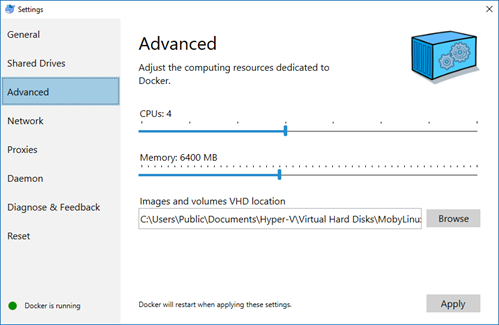 

- Create necessary Docker volumes: 
   - `docker volume create sqlserverdata`
   - `docker volume create rabbitmqdata` 
  

- Configure monitoring (optional).   
   The WebAPIs and Web-Application use Application Insights (AI) for monitoring. When using AI, you can monitor all kinds of characteristics of your application. AI also can automatically build a map of your application:

   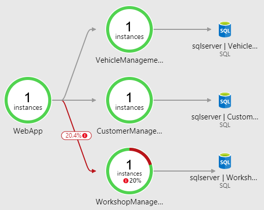

   The name of the nodes is determined by a field called *cloud role name* in the telemetry. This property can be set in several ways. In this case I've chosen to specify the name by setting the environment-variable named *WEBSITE_SITE_NAME*. I set the variable in the Docker file of the WebAPI's and Web-Application using the *ENV* statement.

   If you want to use AI monitoring take the following steps:
   - Create an AI resource in Azure. 
   - Copy the *instrumentation key* from your AI resource. 
   - Create a system-wide environment-variable with the name *PitStopAIKey* and the key as value. The key is read at run-time from the environment-variable.  
   

- Open the PitStop solution in Visual Studio.  

- Add NuGet source
   To prevent project-references between projects in the solution, I've used a public MyGet feed for shared components. The URI for this feed is: `https://www.myget.org/F/pitstop/api/v3/index.json`. This feed contains only the Infrastructure package. Open Visual Studio and configure the NuGet sources and add the MyGet feed: 

   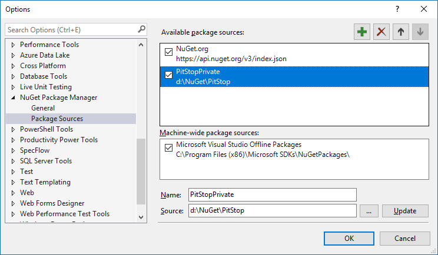.

   > The MyGet feed is read-only. So if you want to make changes to the InfraStructure package, create a pull request with the necessary changes (don't forget to update the version of the package). I will then push the latest version of the package to the MyGet feed.

- Rebuild solution
   To make sure everything is setup correctly, do a Rebuild All of the solution. This will also restore all the NuGet packages used throughout the solution. If no errors occur, you're good to go.

- Build docker images
   Open up a Powershell window and go to the `Pitstop/src` folder. Then execute the `RebuildAllDockerImages` script. This will rebuild all the Docker images for all the projects. Watch the output for any errors. After the images are built, you could check whether they are all there using the `docker images` command. This should yield something like this: 

   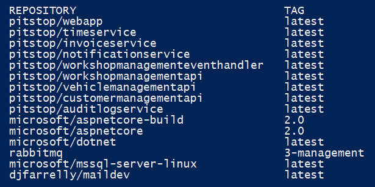

- Start the application
   This is it, you're now ready to spin up the system! Open up a Powershell window and go to the `Pitstop/src` folder. Then issue the following command: `docker-compose up`. 

	> A strange issue that I sometimes encounter with Docker CE on Windows 10 is that the containers are not started the first time after starting the Docker engine. I haven't found a cause for this behavior yet, but the solution that works for me is to restart the docker enigne and try again. You do this by opening the Docker settings through the icon in the system-tray, going to the *Reset* tab and clicking on the *Restart Docker...* link:  
	>
	> 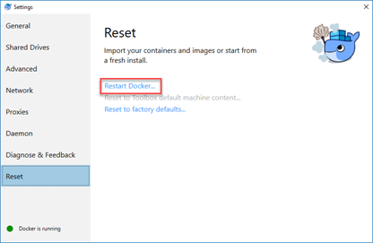

   Because this will start everything in the foreground, you will see all the logging being emitted from the different components. You will probably see a couple of *Unable to connect to RabbitMQ/SQL Server, retrying in 5 sec.* messages in there. This is expected and not a problem. This is Polly doing its work to make sure that failures that occur when calling a component that is still starting up are handled gracefully. 

   The first time the services are started, the necessary databases are automatically created. You could check this by connecting to the SQL Server using SSMS (server *localhost*, port 1434; separate the server and port with a comma in SSMS: `localhost,1434`) and looking at the different databases:

   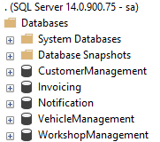

   Upon the registration of the first Maintenance Job, the event-store database *WorkshopManagementEventStore* will be created automatically.

## Testing the app
To test the application you need to open the following web-pages:

- The RabbitMQ management dashboard: [http://localhost:15672](http://localhost:15672). 
   Username: rabbitmquser
   Password: DEBmbwkSrzy9D1T9cJfa

- The MailDev inbox: [http://localhost:4000](http://localhost:4000).

- The PitStop web-application: [http://localhost:7000](http://localhost:7000).

Now you can follow the following scenario (make sure you fill all the fields in the entry-forms):

- Register a new customer on the *Customer Management* screen.
- Register a new Vehicle for this customer on the *Vehicle Management* screen.
- Register a couple of Maintenance Jobs for the vehicle on the *Workshop Management* screen.

Now you've used the basic functionality of the application. We'll test the functionality of the *Notification service* next. 

### Testing notifications
To test the *Notification Service*, make sure you have scheduled a Maintenance Job for today. The *Notification service* reacts to the *DayHasPassed* event that is normally published by the *Time service*. But in stead of waiting until midnight, we'll publish such an event using the RabbitMQ Management Dashboard. Open the browser window (or tab) that shows the RabbitMQ Management Dashboard. Go to the *Exchanges* tab and click the *PitStop* exchange. Now expand the *Publish message* part of the screen. To send the correct event, we need to add a header to the message. You do this by adding a header named *MessageType* and value *DayHasPassed*. The body (payload) of the message should contain an empty object (defined in JSON):

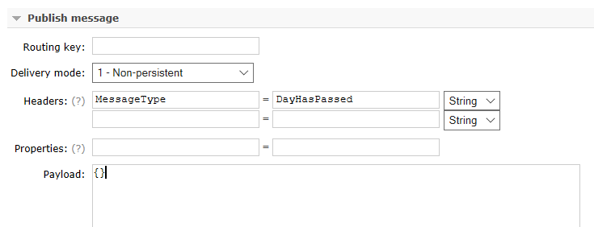

Now you can push the *Publish message* button to send the message. If all goes according to plan, the *Notification Service* will pick up this event, check whether there is a maintenance job scheduled for today (for which no notification has been sent yet) and send a notification email to the customer. This email should be visible in the MailDev in-box:

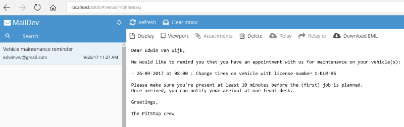

### Testing invoicing
To test the *Invoice Service*, make sure you have scheduled a Maintenance Job for today. Now first complete this Maintenance Job on the *Workshop Management* screen.

The *Invoice service* reacts to the *DayHasPassed* event that is normally published by the *Time service*. But in order to speed this up, we'll publish such an event using the RabbitMQ Management Dashboard. See the description of how to do this under *Testing Notifications* above.

If all goes according to plan, the *Invoice Service* will pick up this event, check whether there are any maintenance jobs completed today (for which no invoice has been sent yet) and send an invoice HTML email to *Presto Print* (a fictitious printing company that will print and snail-mail the invoice to the customer). This email should be visible in the MailDev in-box:

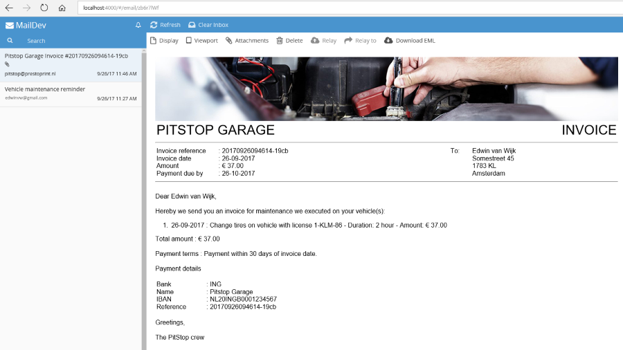

### Testing APIs
If you want to test the individual APIs in the system, you can use the test UIs that are auto-generated by Swashbuckle. The following URLs can be used:

| API                | URL                                                            |
|--------------------|----------------------------------------------------------------|
| CustomerManagement | [http://localhost:5100/swagger](http://localhost:5100/swagger) |
| VehicleManagement  | [http://localhost:5000/swagger](http://localhost:5000/swagger) |
| WorkshopManagement | [http://localhost:5200/swagger](http://localhost:5200/swagger) |

## Contributing
This sample is a personal R&D project for me to learn. I've tried to document it as thoroughly as possible for people wanting to learn from it. If you have any improvements you want to contribute (to the code or the documentation) or find any bugs that need solving, just create a pull-request!

## Disclaimer
The code in this repo is NOT production grade and lacks any automated testing. It is intentionally kept as simple as possible (KISS). Its primary purpose is demonstrating several architectural concepts and not being a full fledged application that can be put into production as is. 

The author can in no way be held liable for damage caused directly or indirectly by using this code.
