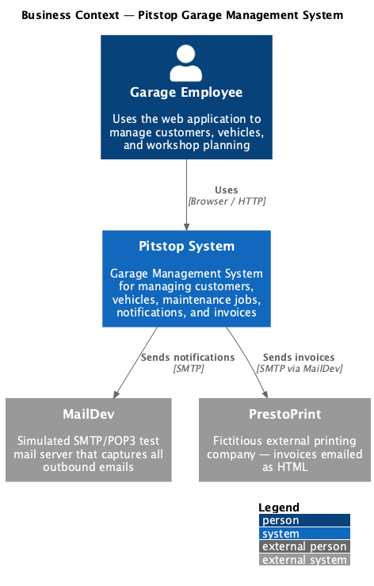
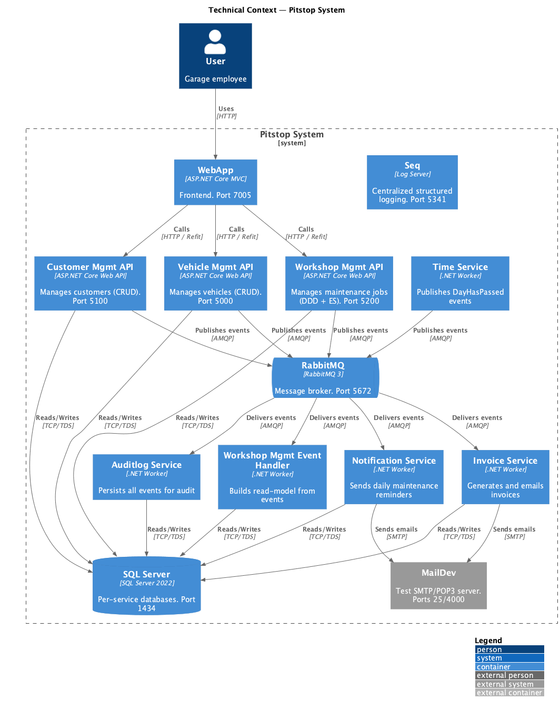

# 3. System Scope and Context

## 3.1 Business Context

Pitstop is used by employees of the fictitious "PitStop" garage. There are no external system integrations besides a simulated print service (PrestoPrint) for invoices and a simulated email server (MailDev).

*Diagram source: [diagrams/03-business-context.puml](diagrams/03-business-context.puml)*

| Actor / System     | Description |
|--------------------|-------------|
| **Garage Employee** | Uses the web application to manage customers, vehicles, and the workshop planning. |
| **MailDev**         | Simulated SMTP/POP3 server that captures all outbound emails (notifications and invoices). In production, this would be a real mail server. |
| **PrestoPrint**     | Fictitious external printing company. Invoices are emailed to them as HTML. Simulated via MailDev. |

## 3.2 Technical Context

*Diagram source: [diagrams/03-technical-context.puml](diagrams/03-technical-context.puml)*

| Channel / Protocol | From → To | Description |
|--------------------|-----------|-------------|
| **HTTP/REST** | Browser → WebApp | User interaction via ASP.NET Core MVC frontend. |
| **HTTP/REST** | WebApp → APIs | Typed HTTP clients (Refit) call Customer, Vehicle, and Workshop Management APIs. No API gateway (see [ADR-0006](../ADRs/0006-no-api-gateway.md)). |
| **AMQP** | APIs → RabbitMQ → Services | Domain events are published to RabbitMQ fanout exchanges and consumed by subscribing services. |
| **TCP (TDS)** | APIs / Services → SQL Server | Each service uses its own logical database on a shared SQL Server instance. |
| **SMTP** | Notification/Invoice Service → MailDev | Emails are sent via SMTP to the MailDev test server. |
| **HTTP** | All services → Seq | Structured log events are sent to the Seq log server (Serilog sink). |

---
[← Back to arc42 index](arc42.md)
