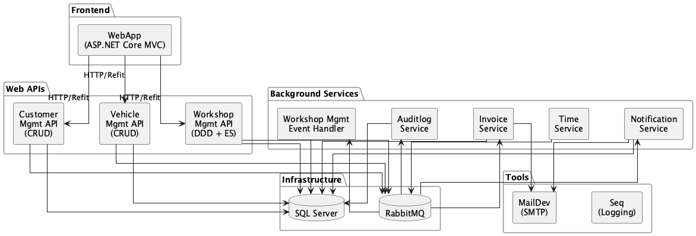
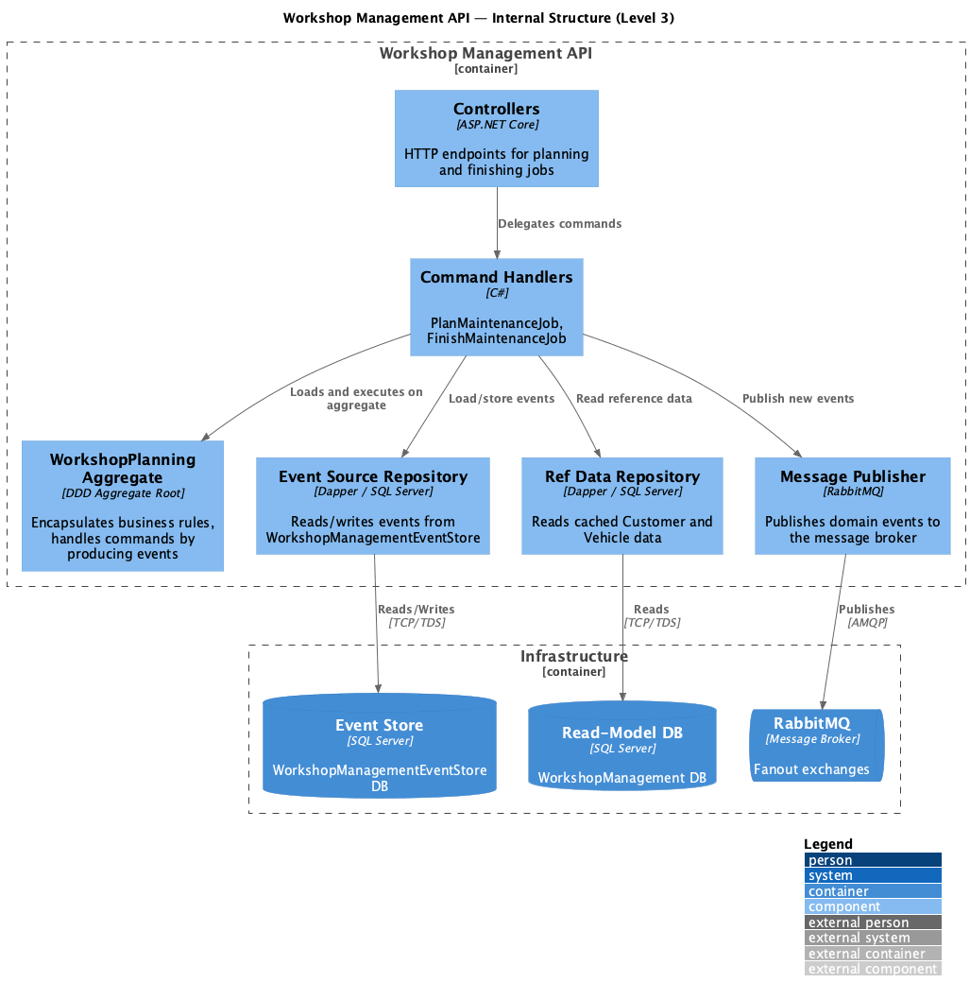

# 5. Building Block View

## 5.1 Level 1 — System Context

The entire Pitstop system decomposes into the following top-level building blocks:

*Diagram source: [diagrams/05-building-blocks-L1.puml](diagrams/05-building-blocks-L1.puml)*

## 5.2 Level 2 — Building Blocks

### WebApp

| Aspect | Description |
|--------|-------------|
| **Responsibility** | Web-based front-end for garage employees. Manages customers, vehicles, and workshop planning. |
| **Technology** | ASP.NET Core MVC, Razor views, Vite (asset bundling). |
| **Communication** | Calls Customer, Vehicle, and Workshop Management APIs via Refit typed HTTP clients. Has no knowledge of the message broker or other services. |
| **Internal structure** | Controllers, Views, ViewModels, RESTClients (Refit interfaces), Commands, Mappers. |

### Customer Management API

| Aspect | Description |
|--------|-------------|
| **Responsibility** | Manages customers — register and retrieve (list/by ID). |
| **Bounded context** | Customer Management (supporting). |
| **Design approach** | CRUD with Entity Framework Core code-first. Auto-migrates database on startup. |
| **Commands handled** | `RegisterCustomer` |
| **Events published** | `CustomerRegistered` |
| **Database** | `CustomerManagement` (SQL Server) |

### Vehicle Management API

| Aspect | Description |
|--------|-------------|
| **Responsibility** | Manages vehicles — register and retrieve (list/by ID). |
| **Bounded context** | Vehicle Management (supporting). |
| **Design approach** | CRUD with Entity Framework Core code-first. Auto-migrates database on startup. |
| **Commands handled** | `RegisterVehicle` |
| **Events published** | `VehicleRegistered` |
| **Database** | `VehicleManagement` (SQL Server) |

### Workshop Management API

| Aspect | Description |
|--------|-------------|
| **Responsibility** | Manages maintenance jobs — plan and finish jobs. Core bounded context of the system. |
| **Bounded context** | Workshop Management (core). |
| **Design approach** | DDD with Aggregates + Event Sourcing. Commands are transformed into events; aggregate state is reconstructed by replaying stored events. |
| **Commands handled** | `PlanMaintenanceJob`, `FinishMaintenanceJob` |
| **Events published** | `WorkshopPlanningCreated`, `MaintenanceJobPlanned`, `MaintenanceJobFinished` |
| **Databases** | `WorkshopManagementEventStore` (event store), `WorkshopManagement` (read-model / reference data) |

### Workshop Management Event Handler

| Aspect | Description |
|--------|-------------|
| **Responsibility** | Consumes events from the message broker and builds a read-model with cached Customer and Vehicle data for the Workshop Management bounded context. |
| **Events handled** | `CustomerRegistered`, `VehicleRegistered`, `MaintenanceJobPlanned`, `MaintenanceJobFinished` |
| **Design note** | Ensures Workshop Management can operate autonomously even when Customer or Vehicle services are offline. |
| **Database** | `WorkshopManagement` (shared with Workshop Management API) |

### Notification Service

| Aspect | Description |
|--------|-------------|
| **Responsibility** | Sends email notifications to customers who have a maintenance job planned for the current day. |
| **Events handled** | `CustomerRegistered`, `DayHasPassed`, `MaintenanceJobPlanned`, `MaintenanceJobFinished` |
| **External dependency** | SMTP (MailDev in development). |
| **Database** | `Notification` (SQL Server) — caches customer and job data. |

### Invoice Service

| Aspect | Description |
|--------|-------------|
| **Responsibility** | Creates and emails invoices for finished maintenance jobs. Invoices are HTML emails sent to PrestoPrint (fictitious). |
| **Events handled** | `CustomerRegistered`, `DayHasPassed`, `MaintenanceJobPlanned`, `MaintenanceJobFinished` |
| **External dependency** | SMTP (MailDev in development). |
| **Database** | `Invoice` (SQL Server) — caches customer and job data. |

### Time Service

| Aspect | Description |
|--------|-------------|
| **Responsibility** | Publishes `DayHasPassed` events to signal time progression. Enables deterministic, testable time-dependent behaviour. |
| **Events published** | `DayHasPassed` |
| **Design note** | No database. Externalises time as an event rather than relying on system clocks or cron jobs. See [ADR-0005](../ADRs/0005-time-service-for-time-progression.md). |

### Auditlog Service

| Aspect | Description |
|--------|-------------|
| **Responsibility** | Consumes all events from the message broker and persists them for audit purposes. |
| **Events handled** | All domain events. |
| **Database** | `Auditlog` (SQL Server) |

### Infrastructure.Messaging (Shared Library)

| Aspect | Description |
|--------|-------------|
| **Responsibility** | Provides broker-agnostic abstractions (`IMessagePublisher`, `IMessageHandler`) and the RabbitMQ implementation. Published as a NuGet package consumed by all services. |
| **Key interfaces** | `IMessagePublisher.PublishMessageAsync(messageType, message, routingKey)`, `IMessageHandler.Start(callback)` / `Stop()` |
| **Implementation** | `RabbitMQMessagePublisher` — creates durable fanout exchanges; publishes with MessageType header; exponential-backoff retry (9 retries). `RabbitMQMessageHandler` — creates exchange, binds queue, async consumer with manual ack. |
| **Design note** | Broker can be swapped by providing a new implementation of the interfaces. See [ADR-0009](../ADRs/0009-infrastructure-messaging-abstraction.md). |

## 5.3 Level 3 — Workshop Management API (Core Domain)

The Workshop Management API is the most architecturally interesting component, using DDD and Event Sourcing:

*Diagram source: [diagrams/05-building-blocks-L3.puml](diagrams/05-building-blocks-L3.puml)*

- **Controllers** receive HTTP commands and delegate to command handlers.
- **Command Handlers** load the aggregate from the event store (by replaying events), execute the command, and persist new events.
- **WorkshopPlanning Aggregate** encapsulates business rules. Commands are transformed into events internally; the aggregate handles events to mutate its state.
- **Event Source Repository** reads/writes events from/to the `WorkshopManagementEventStore` database.
- **Ref Data Repository** reads cached Customer and Vehicle data from the `WorkshopManagement` database (populated by the Event Handler).
- **Message Publisher** publishes domain events to RabbitMQ after successful persistence.

---
[← Back to arc42 index](arc42.md)
