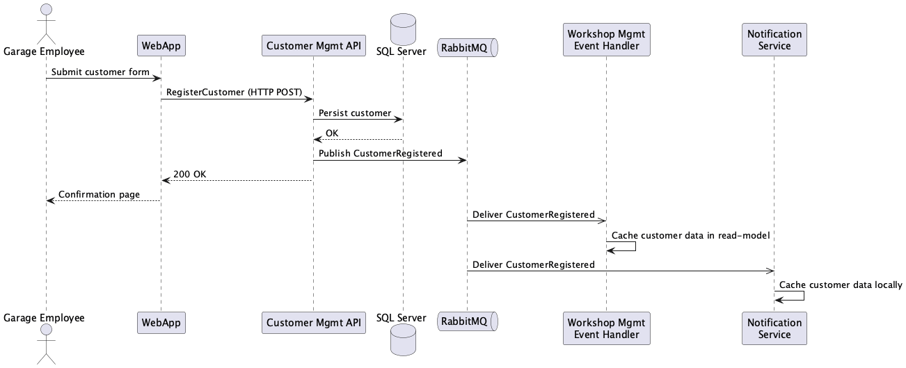
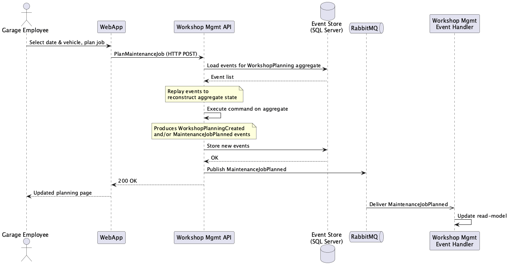
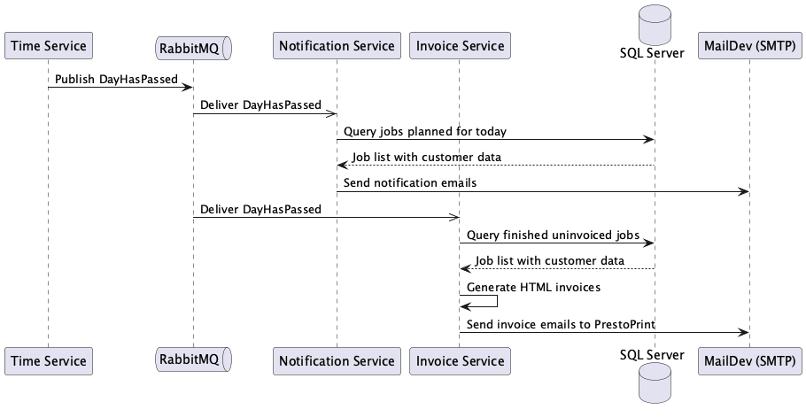
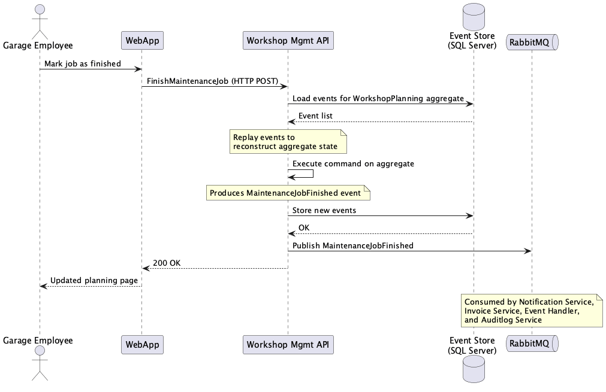

# 6. Runtime View

## 6.1 Register a Customer

A garage employee registers a new customer through the web application.

*Diagram source: [diagrams/06-register-customer.puml](diagrams/06-register-customer.puml)*

1. Employee submits the customer form in the WebApp.
2. WebApp sends a `RegisterCustomer` command to the Customer Management API via HTTP.
3. The API persists the customer to SQL Server and publishes a `CustomerRegistered` event to RabbitMQ.
4. The WorkshopManagementEventHandler and NotificationService consume the event and cache the customer data in their local databases.

## 6.2 Plan a Maintenance Job

*Diagram source: [diagrams/06-plan-maintenance-job.puml](diagrams/06-plan-maintenance-job.puml)*

1. Employee selects a date and vehicle, then plans a maintenance job.
2. WebApp sends a `PlanMaintenanceJob` command to the Workshop Management API.
3. The API loads all events for the `WorkshopPlanning` aggregate (identified by date) from the event store.
4. Events are replayed to reconstruct the aggregate's current state.
5. The command is executed on the aggregate, producing a `MaintenanceJobPlanned` event (and possibly a `WorkshopPlanningCreated` event if this is the first job for that day).
6. New events are persisted to the event store and published to RabbitMQ.
7. The WorkshopManagementEventHandler updates the read-model.

## 6.3 Day Passes — Notifications and Invoices

*Diagram source: [diagrams/06-day-passes.puml](diagrams/06-day-passes.puml)*

1. The TimeService publishes a `DayHasPassed` event.
2. The NotificationService queries its local database for maintenance jobs planned for the current day and sends reminder emails to customers.
3. The InvoiceService queries its local database for finished (uninvoiced) maintenance jobs, generates HTML invoices, and emails them to PrestoPrint.

## 6.4 Finish a Maintenance Job

*Diagram source: [diagrams/06-finish-maintenance-job.puml](diagrams/06-finish-maintenance-job.puml)*

The flow is identical to planning a job: load aggregate from event store, replay, execute command, persist new events, publish `MaintenanceJobFinished`. Downstream services (Notification, Invoice, EventHandler) consume this event.

---
[← Back to arc42 index](arc42.md)
