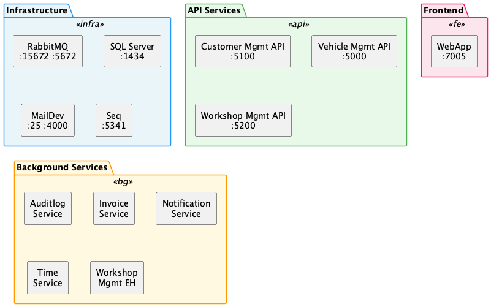

# 7. Deployment View

## 7.1 Docker Compose (Local Development)

The primary deployment model is Docker Compose. All services and infrastructure are defined in `docker-compose.yml`.

*Diagram source: [diagrams/07-deployment.puml](diagrams/07-deployment.puml)*

### Container Images

| Container | Image | Ports (host:container) |
|-----------|-------|----------------------|
| rabbitmq | `rabbitmq:3-management-alpine` | 15672:15672 (management UI), 5672:5672 (AMQP) |
| sqlserver | `mcr.microsoft.com/mssql/server:2022-latest` | 1434:1433 |
| mailserver | `maildev/maildev:1.1.0` | 25:25 (SMTP), 4000:80 (web UI) |
| logserver | `datalust/seq:latest` | 5341:80 |
| vehiclemanagementapi | `pitstop/vehiclemanagementapi:1.0` | 5000 (dynamic) |
| customermanagementapi | `pitstop/customermanagementapi:1.0` | 5100 (dynamic) |
| workshopmanagementapi | `pitstop/workshopmanagementapi:1.0` | 5200 (dynamic) |
| auditlogservice | `pitstop/auditlogservice:1.0` | — |
| invoiceservice | `pitstop/invoiceservice:1.0` | — |
| notificationservice | `pitstop/notificationservice:1.0` | — |
| timeservice | `pitstop/timeservice:1.0` | — |
| workshopmanagementeventhandler | `pitstop/workshopmanagementeventhandler:1.0` | — |
| webapp | `pitstop/webapp:1.0` | 7005:7005 |

### Data Volumes

SQL Server, RabbitMQ, and other stateful services mount volumes under `.containerdata/` for data persistence across restarts.

## 7.2 Kubernetes

Kubernetes manifests are provided in the `k8s/` folder. The deployment includes:

- **Deployments** for each service
- **Services** (ClusterIP) for internal networking
- **NodePort** services for external access (WebApp, RabbitMQ management, Seq, MailDev)
- SQL Server port changes to `30000` when running on Kubernetes

### Optional: Service Mesh

Two service mesh implementations are supported:

- **Istio** — VirtualService and DestinationRule resources for traffic management, canary releases, fault injection, and traffic mirroring.
- **Linkerd** — Alternative lightweight service mesh with automatic proxy injection.

See [ADR-0010](../ADRs/0010-kubernetes-with-service-mesh.md) for details.

## 7.3 Docker Image Build

All services use multi-stage Docker builds:

1. **SDK image** (`dotnet-sdk-base-dockerfile`) — Used for building the application.
2. **Runtime image** (`dotnet-aspnet-base-dockerfile` or `dotnet-runtime-base-dockerfile`) — Minimal image for running the compiled application.
   - API services use the ASP.NET base image (includes web server).
   - Background services use the runtime-only base image.

Each Dockerfile includes a `HEALTHCHECK` statement that periodically calls the service's `/hc` endpoint.
