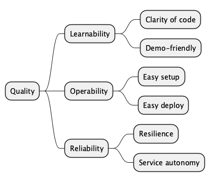

# 10. Quality Requirements

## 10.1 Quality Tree

*Diagram source: [diagrams/10-quality-tree.puml](diagrams/10-quality-tree.puml)*

## 10.2 Quality Scenarios

### Learnability

| ID | Scenario | Measure |
|----|----------|---------|
| L1 | A .NET developer clones the repository and wants to understand the microservices architecture. | The developer can understand the overall architecture and the role of each service within 30 minutes by reading the documentation and browsing the code. |
| L2 | A conference attendee watches a demo and wants to see event-driven communication in action. | The presenter can register a customer and show the event flowing to consuming services via the Seq log server in real-time. |
| L3 | A developer wants to understand how event sourcing works. | The WorkshopManagementAPI provides a clear, isolated implementation of event sourcing with DDD aggregates that can be studied independently. |

### Operability

| ID | Scenario | Measure |
|----|----------|---------|
| O1 | A developer wants to run the entire system locally. | Running `docker compose up` starts all services and infrastructure. The system is accessible at `http://localhost:7005` within 2 minutes. |
| O2 | A developer wants to deploy the system on Kubernetes. | Kubernetes manifests in the `k8s/` folder can be applied to a cluster. The system starts successfully with service mesh (Istio or Linkerd) as an optional add-on. |
| O3 | An operator wants to inspect the health of a running service. | Every API service exposes a `/hc` endpoint returning health status. Docker performs health checks every 30 seconds. |

### Reliability

| ID | Scenario | Measure |
|----|----------|---------|
| R1 | SQL Server is slow to start during `docker compose up`. | Services retry database connections with exponential backoff (Polly). After SQL Server is ready, services connect successfully without manual intervention. |
| R2 | RabbitMQ is temporarily unavailable. | Services retry message broker connections with exponential backoff. Published messages are retried up to 9 times. |
| R3 | The Customer Management API is offline when a maintenance job is being planned. | The Workshop Management bounded context operates autonomously using its local read-model (cached customer and vehicle data). |
| R4 | The WebApp cannot reach a backend API after multiple retries. | Polly circuit-breaker triggers and the WebApp falls back to an offline page rather than showing an error to the user. |

---
[← Back to arc42 index](arc42.md)
