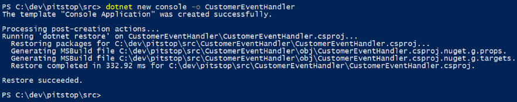
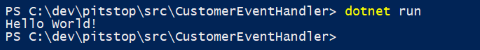
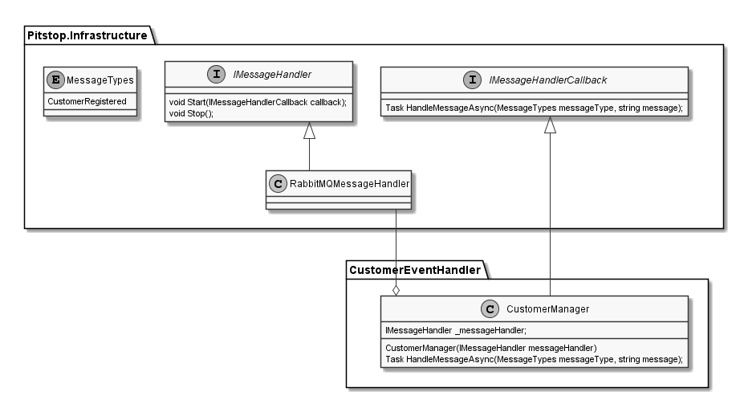
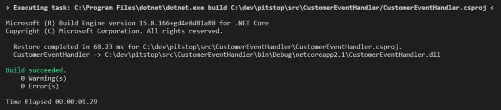
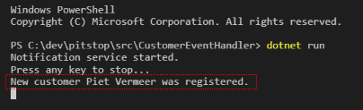
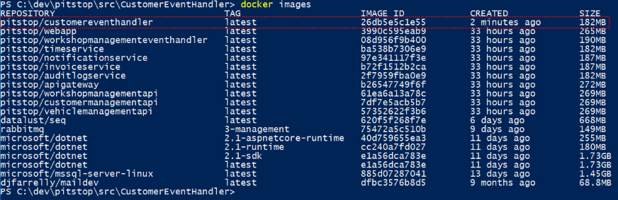
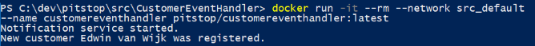
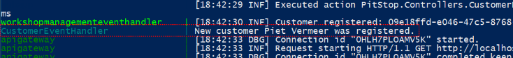

# PitStop Workshop
Welcome to the PitStop workshop! In this workshop you will learn how to build Microservices based systems using .NET Core and Docker. In most workshops you start from scratch, but in this workshop you will actually start with a complete working solution. You will learn by adding functionality to the solution.

## Lab 0: Preparation
There are some prerequisites for this workshop. First you need an active Internet connection. Additionally you will need to install the following software on your laptop:

- Docker Community Edition (CE)
- Visual Studio 2017 (Community or Code)
- .NET Core SDK
- (optional) Git client

>If you already have satisfied these prerequisites, you can skip Lab 0 and go directly to [Lab 1](#lab-1:-run-the-application). 

### Step 0.1: Install prerequisites
Install the following software (if not already installed) on your laptop: 

#### Docker CE
Download link: <a href="https://docs.docker.com/install" target="_blank">Docker Community Edition (CE)</a>. 

On Windows, you need Hyper-V to be enabled on your machine in order to install Docker for Windows CE. If you have not enabled Hyper-V, do so now. <a href="https://docs.microsoft.com/en-us/virtualization/hyper-v-on-windows/quick-start/enable-hyper-v" target="_blank">Here</a> you find a description of how to enable Hyper-V on Windows. Make sure to double-check the prerequisites.

For downloading Docker CE, you need to login with your Docker Id. Create one if you don't already have a Docker Id. 

During the installation of Docker CE, do not switch to Windows containers. We will only use Linux containers. After the installation you need to log out and login again (sometimes reboot your machine).

After the installation, start the Docker engine by double clicking the Docker for Windows icon. 

#### Visual Studio
This workshop assumes you are working with Visual Studio Code. If you use Visual Studio CE, there will be some minor differences.

Download link: <a href="https://visualstudio.microsoft.com/downloads" target="_blank">Visual Studio 2017 (Community or Code)</a>

#### .NET Core SDK
Install the .NET Core SDK 2.1. 

Download link: <a href="https://www.microsoft.com/net/download" target="_blank">.NET Core SDK</a>

#### Git client (optional)
Optionally you can install the Git client for your OS to interact with the PitStop repo on Github. This is optional because you can also download the code from Github in a zip file. 

Download link: <a href="https://git-scm.com/downloads" target="_blank">Git</a> 

### Step 0.2: Access Github
If you do not already have a Github account, create one by going to the <a href="https://www.hithub.com" target="_blank">Github website</a> and click on the *Sign up* link in the top right corner. Make sure you are logged into Github with your account. 

---

## Lab 1: Run the applicaton
In this lab we'll make sure you can run PitStop on your machine. This will involve the following activities:

- [Get the sources](#step-1.1:-get-the-sources)
- [Build the Docker images](#step-1.2:-build-the-docker-images)
- [Run the application](#step-1.3:-run-the-application)
- [Get to know the solution](#step-1.4:-get-to-know-the-solution)

### Step 1.1: Get the sources
There are 2 ways of getting the sources from Github onto your machine: download a zip file from Github or fork and clone the repo. Both are described below, choose the one that works best for you.

**Download a zip file**
1. Open your browser and navigate to the PitStop repo on Github: <a href="https://github.com/edwinvw/pitstop" target="_blank">https://github.com/edwinvw/pitstop</a>. 
2. Click the green *Clone or download* button. A dialog is shown. 
3. Click the *Download ZIP* button and store the zip file on your machine. 
4. Extract the zip file into an arbitrary folder (e.g. `c:\dev`).
5. Open Visual Studio Code on your machine.
6. Open the `pitstop/src` folder in the folder into which you extracted the zip file. Now you can start working with the code.

**Fork and clone the repo**
For this to work, you must have installed the Git client (see [Step 0.1](#step-0.1:-install-prerequisites)). 
1. Open your browser and navigate to the PitStop repo on Github: <a href="https://github.com/edwinvw/pitstop" target="_blank">https://github.com/edwinvw/pitstop</a>. 
2. Click the *Fork* button.
3. The repo is forked to your Github account. If you have multiple accounts, Github will ask which account to fork to.
4. Click the green *Clone or download* button on the forked repo. A dialog is shown.
5. Copy the repo URL to the clipboard. 
6. Open Visual Studio Code on your machine.
7. Give the clone repo command by pressing `CTRL-Shift-P`, typing `Git Clone` and pressing `enter` to confirm. You will be asked to specify a repo URL.
8. Paste the copied repo URL in the text-box and press `enter` to confirm.
9. You will be asked to specify a folder for cloning the repo into. Select a folder and confirm. The repo will be cloned in this folder.
10. When VS Code asks you to open the cloned repo, do that. Now you can start working with the repo.

This would be a good time to walk through the solution and see what's in there. In the <a href="https://github.com/EdwinVW/pitstop/wiki" target="_blank">Wiki</a> of the repo, you can find an overview of the solution structure. 

### Step 1.2: Build the Docker images
In order to build the Docker images, follow the instructions in the <a href="https://github.com/EdwinVW/pitstop/wiki/Building%20the%20Docker%20images" target="_blank">'Building the Docker images' section</a> in the repo's Wiki.

### Step 1.3: Run the application
In order to run the application, follow the instructions in the <a href="https://github.com/EdwinVW/pitstop/wiki/Run%20the%20application%20using%20using%20Docker%20Compose" target="_blank">'Starting the application' section</a> in the repo's Wiki.

### Step 1.4: Get to know the solution
In order to get to know the functionality of the application, make sure you have read the introduction of the solution in the repo's README file up to the *Technology* section. After that follow the <a href="https://github.com/EdwinVW/pitstop/wiki/Testing%20the%20application" target="_blank">'Testing the application' section</a> in the repo's Wiki. 

---

## Lab 2: Add handler for customer events
When something happens within the PitStop application that could be interesting for other parts of the system, an event is published to the message-broker. For instance: when a new customer is registered, a *CustomerRegistered* event is published. 

In this lab you will add a service to the solution that will react to customer events. What we will do when the event is received is up to your imagination. For the workshop, we will keep it simple and just dump a message on the console. 

The service we will build offers no API and can therefore be a simple console application (just as the existing *NotificationService* for instance). 

This lab will involve the following steps:

- [Creating a new .NET Core console application](#step-2.1:-create-the-.net-core-application)
- [Write an event-handler that will ingest messages from the message-broker](#step-2.2:-create-event-handler).
- [Running and testing the service](#step-2.3:-run-the-service)
- [Building a Docker image for the service](#step-2.4:-create-docker-image)
- [Running the service in a Docker container](#step-2.5:-run-the-service-in-a-docker-container)
- [Running the service using docker-compose](#step-2.6:-run-the-service-using-docker-compose)

### Step 2.1: Create the .NET Core application
First we will add a new service to the solution. 

1. Open a command-prompt or Powershell window.
2. Make sure you are in the `src` folder within the PitStop repository.
3. Use the `dotnet new` command to create a new .NET Core console application named *CustomerEventHandler*:
   ```
   dotnet new console -o CustomerEventHandler
   ```
   The output should look something like this:

   

A new *CustomerEventHandler* folder will be created which contains a .NET Core project. Because the created project-type is a console application, the folder will only contain a project file (*CustomerEventHandler.csproj*) and a main program file (*Program.cs*). The default implementation generated by `dotnet new` is printing *'Hello World!'* to the console.

You can test the application by running it:

```
cd CustomerEventHandler
dotnet run
```

The output should look like this:



### Step 2.2: Create event-handler
Now that you've added a new .NET Core project to the solution, you can start implementing the business logic of the service. As stated, the 'business logic' will be fairly simple for this workshop.

**Open the project in VS Code**
Let's open Visual Studio Code to start coding:

1. Start Visual Studio Code.
2. Select *File*, *Open Folder* and select the *CustomerEventHandler* folder you created in step 2.1. 
   >Visual Studio Code might show you some dialogs about plugins that you can install. For now, just install all plugins that it suggests. It will also asks you to add some 'assets' it needs for building and debugging the project. Acknowledge this with 'Yes'. This will create a '.vscode' folder. You can ignore that folder for now.
   
3. Open the file *CustomerEventHandler.csproj* by double-clicking on it. This is the file that describes the project. It is pretty straightforward and clean.
4. Start the application by pressing `F5`. The project will be built and started. You can see the output in the 'DEBUG CONSOLE' window that was automatically opened.

**Add reference to the infrastructure package**
The CustomerEventHandler service will need to receive messages from the message-broker. I have created a nuget package (*PitStop.Infrastructure*) that contains a library that will make it easy to implement this without any specific knowledge about RabbitMQ (the broker that is used in the solution). 

You need to add a reference to the *PitStop.Infrastructure* nuget package. The package is hosted in a private MyGet feed on the Internet. The location of the feed is specified in the nuget.config file in the solution, so it will automatically be resolved.

Follow the following steps to add a reference to the package: 

1. Open the terminal window in Visual Studio Code using the *Terminal* menu.
2. Type the following command in this window: `dotnet add package PitStop.Infrastructure`. 
3. In the .csproj file the following XML snippet will be added: 
   ```xml
   <ItemGroup>
     <PackageReference Include="Pitstop.Infrastructure" Version="3.5.2" />
   </ItemGroup>
   ```
4. Visual Studio Code will detect changes in the references and automatically restore the references.

**Add event definition**
Now you can start adding some business logic. First you need to add the definition of the events you want to handle. All messages that are sent over the message-broker are plain JSON. The *CustomerRegistered* event is defined as follows:

```json
{
	"messageId": "guid",
	"messageType": "string",
	"customerId" : "string",
	"name": "string",
	"address": "string",
	"postalCode": "string",
	"city": "string",
	"telephoneNumber": "string",
	"emailAddress": "string"
}
```

You need to define a C# class to hold this information. We will only use the *name* property in our code, so in your event-definition you can skip the other customer properties.

The infrastructure package you referenced in the previous step contains an *Event* base-class for events. This base-class contains the *messageId* and *messageType* properties. For convenience, the infrastructure package also contains an *MessageTypes* enum with all the available message-types in the solution. 

Follow the following steps to add the *CustomerRegistered* event-definition to your service:

1. Add a new file to the project named *CustomerRegistered.cs*.
2. Paste the following code into the new file:
   ```csharp
	using System;
	using Pitstop.Infrastructure.Messaging;
	
	namespace CustomerEventHandler
	{
	   public class CustomerRegistered : Event
	   {
	       public readonly string CustomerId;
	       public readonly string Name;
	
	       public CustomerRegistered(Guid messageId, string customerId, string name) : 
	           base(messageId, MessageTypes.CustomerRegistered)
	       {
	           CustomerId = customerId;
	           Name = name;
	       }
	   }
	}
   ```

**Add a *CustomerManager* class that handles events**
Now that you have a definition of the event, you will add a *CustomerManager* class that will get the events from the message-broker and handles them. The polling for messages and the handling of a message when it's available are abstracted in two separate interfaces: *IMessageHandler* and *IMessageHandlerCallback*. They are both defined in the infrastructure package.  

The *IMessageHandler* interface abstracts the polling for messages on a message-broker. An implementation of this interface will be passed into your *CustomerManager*'s constructor. The infrastructure package also contains an implementation of this interface that works with RabbitMQ. 

When you want to start listening for messages, you have to call the *Start()* method on this interface and pass in an implementation of the *IMessageHhandlerCallback* interface. The *HandleMessageAync()* method is called on the callback implementation when a message is available on the message-broker. The *CustomerManager* will implement this interface and handle the events.

This is a class diagram of this pattern:

 
Execute the following steps to add the *CustomerManager* to your project:

1. Add a new file to the project named *CustomerManager.cs*.
2. Paste the following code into the new file:
   ```csharp
	using Newtonsoft.Json.Linq;
	using System.Threading.Tasks;
	using Pitstop.Infrastructure.Messaging;
	
	namespace CustomerEventHandler
	{
	    public class CustomerManager : IMessageHandlerCallback
	    {
	        IMessageHandler _messageHandler;
	
	        public CustomerManager(IMessageHandler messageHandler)
	        {
	            _messageHandler = messageHandler;
	        }
	
	        public void Start()
	        {
	            _messageHandler.Start(this);
	        }
	
	        public void Stop()
	        {
	            _messageHandler.Stop();
	        }
	
	        public async Task<bool> HandleMessageAsync(MessageTypes messageType, string message)
	        {
	            JObject messageObject = MessageSerializer.Deserialize(message);
	            switch (messageType)
	            {
	                case MessageTypes.CustomerRegistered:
	                    await HandleAsync(messageObject.ToObject<CustomerRegistered>());
	                    break;
	                default:
	                    break;
	            }
	            return true;
	        }
	
	        private Task HandleAsync(CustomerRegistered cr)
	        {
	            System.Console.WriteLine($"New customer {cr.Name} was registered.");
	            return Task.CompletedTask;
	        }
	    }
	}

   ```

> Please take some time to go over the code now. It is fairly simple, but make sure you exactly understand what's going on here before continuing to the next step.
> 
> Details to notice:
> - *this* is passed to the call to *IMessageHandler.Start()*. This makes the *CustomerManager* the *IMessageHandlerCallback* implementation that is being called when a message is available.
> - Only messages with message-type *CustomerRegistered* are handled. All other messages are ignored.
> - We return true from the *HandleMessageAsync()* method to signal that the message was successfully processed.
> - Deserialization of the message is done using the *.ToObject()* extension-method that has been defined in the infrastructure package. 

**Start the customermanager**
Now that you created a *CustomerManager* that can handle *CustomerRegistered* events, you need to start this manager form the main program. You will use the *RabbitMQMessageHandler* class from the infrastructure package to pass into the *CustomerManager*. 

1. Open the *Program.cs* file in the project.
2. Replace the content of this file with the following code:
   ```csharp
	using System;
	using System.Threading;
	using Pitstop.Infrastructure.Messaging;
	
	namespace CustomerEventHandler
	{
	    class Program
	    {
	        private static string _env;
	        
	        static void Main(string[] args)
	        {
	            // determine environment
	            _env = Environment.GetEnvironmentVariable("PITSTOP_ENVIRONMENT") ?? "Development";
	
	            // create rabbitmq message-handler
	            string rabbitMQHost = (_env == "Development") ? "localhost" : "rabbitmq";
	            RabbitMQMessageHandler messageHandler = 
	                new RabbitMQMessageHandler(rabbitMQHost, "rabbitmquser", "DEBmbwkSrzy9D1T9cJfa", "Pitstop", "CustomerEventHandler", "");
	
	            // start customermanager
	            CustomerManager manager = new CustomerManager(messageHandler);
	            manager.Start();    
	            
	            // wait for exit
	            if (_env == "Development")
	            {
	                Console.WriteLine("CustomerEventHandler started.");
	                Console.WriteLine("Press any key to stop...");
	                Console.ReadKey(true);
	                manager.Stop();
	            }
	            else
	            {
	                Console.WriteLine("CustomerEventHandler started.");
	                while (true)
	                {
	                    Thread.Sleep(10000);
	                }
	            }
	        }
	    }
	}

   ```

> Please take some time to go over the code now. It is fairly simple, but make sure you exactly understand what's going on here before continuing to the next step.
> 
> Details to notice:
> - We pass in the following arguments to the *RabbitMQMessageHandler* constructor: *host*, *username*, *password*, *exchange*, *queue*, *routing-key*. If the specified exchange or queue do not exist, they are automatically created.  
> - Based on the environment we use a different RabbitMQ hostname and use a different approach to waiting for exit. Set the *PITSTOP_ENVIRONMENT* environment variable on your machine to deviate from the default (*Development*). When running in a Docker container later, the environment variable will automatically be set to *Production*.

**Build the code**
In order to check whether or not you made any mistakes until now, build the code. Do this by pressing `Ctrl-Shift-B` in Visual Studio Code and choosing the task *Build*. The output window should look like this:

 

### Step 2.3: Run the service
We can start the *CustomerEventHandler* to test whether or not it works. 

1. Make sure you have the PitStop application running on your machine (as described in [Step 1.3: Run the application](#step-1.3:-run-the-application)).
2. Open a command prompt or Powershell window and go to the *CustomerEventHandler* folder.
3. Start the application by giving the following command: `dotnet run`.
4. Open the browser and go to http://localhost:7000 to open the PitStop web-app.
5. Go to the *Customer Management* tab and register a new customer.

Watch the output window of your *CustomerEventHandler*. You should see that a message is printed to the console, something like this:

 

That's it! You have now created a new service that can react on events emitted by the services in the PitStop solution. Pretty sweet!

**Before continuing, stop the *CaseEventHandler* by pressing a random key.**

### Step 2.4: Create Docker image
Now that you have created a functional service, let's run it in a Docker container.

1. Add a new file to the project named *Dockerfile*.
2. Paste the following code into the new file:
   ```docker
	FROM microsoft/dotnet:2.1-sdk AS build-env
	WORKDIR /app
	
	# Copy necessary files and restore as distinct layer
	COPY *.csproj ./
	RUN dotnet restore -s https://api.nuget.org/v3/index.json -s https://www.myget.org/F/pitstop/api/v3/index.json
	
	# Copy everything else and build
	COPY . ./
	RUN dotnet publish -c Release -o out
	
	# Build runtime image
	FROM microsoft/dotnet:2.1-runtime
	COPY --from=build-env /app/out .
	
	# Set environment variables
	ENV PITSTOP_ENVIRONMENT=Production

	# Start
	ENTRYPOINT ["dotnet", "CustomerEventHandler.dll"]

   ```

> Please take some time to go over the Dockerfile now. You see an example of the Docker multi-stage build mechanism. 
> - First it starts in a container that is based on an image that contains the full .NET Core SDK (*microsoft/dotnet:2.1-sdk*). We call this *build-env* for later reference.
> - After that it sets the folder */app* as the current working-folder for the build. It copies the *.csproj* file of your project into to the working-folder. 
> - Then it restores all the dependencies by running `dotnet restore` and specifying both the default nuget feed as well as the private PitStop MyGet feed as sources for finding nuget packages. 
> - After the restore, it copies the rest of the files to the working-folder and publishes the application by running `dotnet publish -c Release -o out`. It builds the *Release* configuration and outputs the result in the folder *out* within the working-folder.
> - Now it starts the second phase which runs in a container based on the .NET Core run-time container (*microsoft/dotnet:2.1-runtime*). This container does not contain the entire .NET Core SDK - so it's much smaller.
> - It then copies the output from the other build phase (that was called *build-env*) to the local folder within the container.
> - It sets the *PITSTOP_ENVIRONMENT* environment-variable to *Production*.
> - Finally is specifies the entry-point - the command to execute when the container starts. In this case it specifies the command `dotnet` and as argument the assembly that was created during the build. This will start the *CustomerEventHandler* console application you've created.

Now you are going to build a Docker image using the Dockerfile.

1. Open a command prompt or Powershell window and go to the *CustomerEventHandler* folder.
2. Build a Docker image by entering the following command: 

	`docker build --rm -t pitstop/customereventhandler .`

   > You specify the name of the image using the *Tag* option (`-t`).
3. Check whether the image is created by entering the following command: `docker images`:

   

### Step 2.5: Run the service in a Docker container
Now that you have the Docker image, you can start a container based on this image. 

1. Run a Docker container based on the image by entering the following command:

	`docker run -it --rm --network src_default --name customereventhandler pitstop/customereventhandler:latest`

   >In this command you specify the virtual network to connect with. In this case we specify the name of the default network that was created by docker-compose when we started the solution (*src_default*). By doing this, the container can find and access the RabbitMQ server that is running in a separate Docker container on the virtual network.
2. Open the browser and go to http://localhost:7000 to open the PitStop web-app.
3. Go to the *Customer Management* tab and register a new customer.

Watch the output of your running container. You should see that message again that indicates that a customer was registered:



**Before you continue, stop the running container by pressing `Ctrl-C`.**

### Step 2.6: Run the service using docker-compose
The last step in this lab is to extend the docker-compose file to include your service. 

1. Open the *docker-compose* file in the *src* folder of the PitStop repo in Visual Studio Code.
2. Add this snippet to the *docker-compose* file just before the webapp part:
 
   ```
     customereventhandler:
       image: pitstop/customereventhandler:latest
       build: CustomerEventHandler
       container_name: CustomerEventHandler
       depends_on:
         - rabbitmq
       environment:
         - PITSTOP_ENVIRONMENT=Production    
   ```
3. Save the file.
4. Open the Powershell window where you started the solution using `docker-compose up`.
5. Stop the running solution by pressing `Ctrl-C` and wait until all the containers are stopped.
6. Restart the solution by giving the command: `docker-compose up`. The *CustomerEventHandler* will be started together with all the other services.
2. Open the browser and go to http://localhost:7000 to open the PitStop web-app.
3. Go to the *Customer Management* tab and register a new customer.

Watch the docker-compose logging in the console. You should see that message again that indicates that a customer was registered:



This is the end of this lab. I hope you have enjoyed working with this sample solution and learned some new things along the way. If you have some more time to spend, look at the advanced labs below. If you have your own ideas for cool labs, please let me know or write one yourself and do a pull request.

Thanks!

---

## Advanced Labs 
The following labs are more advanced labs you can do on your own if you're done with the first two labs. There's no extensive description on how to complete these labs, only a description of the required outcome. It's up to you to figure out the best way to implement these requirements. 

### Add update functionality to PitStop
The current version of PitStop only supports adding customers, vehicles and maintenance jobs. There is no way to update these. 

>This lab's assignment is: add support for updating the data of customers, vehicles and / or maintenance jobs.

### Add Inventory management
During a maintenance job, a mechanic often uses products like: tires, windscreen-wipers, oil, oil-filters, etcetera. There is currently no way to support this in PitStop. 

>This lab's assignment is: add an *InventoryManagement* service to the solution that can be used to manage the products in stock. Also add the ability for a mechanic to add products that he or she used when completing a maintenance-job to the solution. For every product used, the inventory must be updated and the price of the products must be added to the bill that is sent to the customer. 